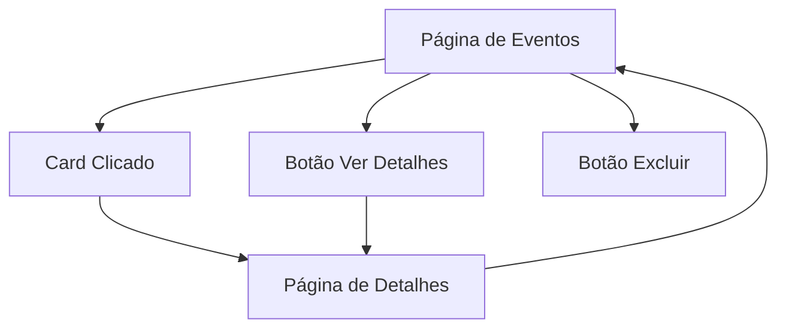

## 1. Product Overview
Redesenho completo da página de gestão de eventos para /admin/events com layout baseado em cards clicáveis. O objetivo é melhorar a visualização e gestão dos eventos, proporcionando uma experiência mais intuitiva e moderna para os administradores.

## 2. Core Features

### 2.1 User Roles
| Role | Registration Method | Core Permissions |
|------|---------------------|------------------|
| Admin | Sistema interno | Acesso completo à gestão de eventos, visualização de estatísticas e detalhes |

### 2.2 Feature Module
Nosso sistema de gestão de eventos consiste nas seguintes páginas principais:
1. **Página de Eventos**: Lista de eventos em formato de cards com informações básicas e ações rápidas.
2. **Página de Detalhes do Evento**: Visualização completa com estatísticas detalhadas e lista de inscritos.

### 2.3 Page Details
| Page Name | Module Name | Feature description |
|-----------|-------------|---------------------|
| Página de Eventos | Cards de Eventos | Exibir eventos em cards coloridos com nome, data (DD/MM/AAAA HH:mm), número de inscritos em badge destacado. |
| Página de Eventos | Ações do Card | Tornar card completamente clicável, botão "Ver detalhes" visível, botão de exclusão vermelho e identificável. |
| Página de Eventos | Layout Responsivo | Adaptação automática para mobile e desktop com cards reorganizados. |
| Detalhes do Evento | Informações Completas | Mostrar todos os dados do evento com layout organizado e intuitivo. |
| Detalhes do Evento | Estatísticas | Exibir total de inscrições, pagas vs pendentes, total recebido, distribuição por tipos de pagamento. |
| Detalhes do Evento | Lista de Inscritos | Apresentar nome, status de pagamento, data de inscrição e informações relevantes dos participantes. |

## 3. Core Process

## 4. User Interface Design

### 4.1 Design Style
- **Cores**: Baseadas no sistema hexadecimal com variações para cada card
- **Cards**: Design moderno com sombras suaves e bordas arredondadas
- **Ícones**: Modernos e intuitivos (calendário, relógio, usuários)
- **Tipografia**: Fonte legível com hierarquia visual clara
- **Botões**: Estilo 3D sutil com estados hover visíveis

### 4.2 Page Design Overview
| Page Name | Module Name | UI Elements |
|-----------|-------------|-------------|
| Página de Eventos | Grid de Cards | Layout em grid responsivo, cards com altura uniforme, cores variadas por evento, badges destacados em azul ou verde. |
| Card de Evento | Informações | Nome em fonte grande e negrito, data com ícone de calendário, badge de inscritos no canto superior direito. |
| Card de Evento | Botões | Botão "Ver detalhes" primário, botão excluir vermelho com ícone de lixeira, ambos com espaçamento adequado. |
| Detalhes do Evento | Cabeçalho | Título do evento destacado, data/hora prominentes, botão voltar. |
| Detalhes do Evento | Estatísticas | Cards de métricas com ícones, gráficos simples para distribuição de pagamento, cores consistentes. |
| Detalhes do Evento | Tabela Inscritos | Tabela responsiva com status colorido, ordenação por data, busca rápida. |

### 4.3 Responsiveness
- **Desktop-first**: Layout otimizado para telas grandes com grid de 3-4 colunas
- **Mobile**: Cards empilhados verticalmente, informações reorganizadas
- **Touch optimization**: Áreas clicáveis ampliadas para dispositivos móveis