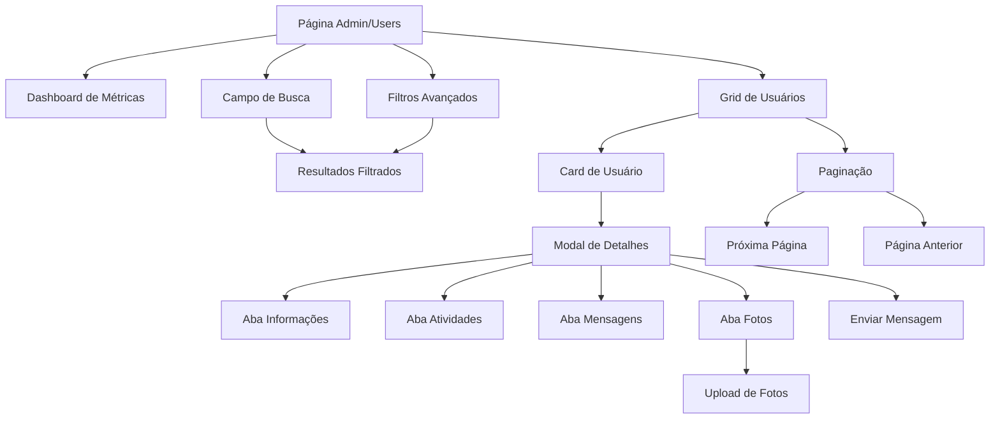

## 1. Visão Geral do Produto

Redesign completo da página de administração de usuários para uma interface profissional e moderna. O objetivo é transformar a experiência visual mantendo todas as funcionalidades existentes (filtros, busca, modal, paginação) com um design harmonioso, cards organizados, ícones coloridos e alinhamento perfeito de elementos.

### Problemas a resolver:

* Interface atual com aparência desatualizada e pouco profissional

* Falta de harmonia visual entre cores e elementos

* Cards desorganizados e sem estética consistente

* Ícones e textos mal alinhados

### Valor do produto:

* Melhorar a experiência do administrador com interface moderna e intuitiva

* Aumentar a eficiência na gestão de usuários através de design otimizado

* Transmitir profissionalismo e confiança através de design harmonioso

## 2. Funcionalidades Principais

### 2.1 Papéis de Usuário

| Papel                | Método de Registro         | Permissões Principais                                       |
| -------------------- | -------------------------- | ----------------------------------------------------------- |
| Administrador Master | Convite especial           | Acesso total ao sistema, gerenciamento de todos os usuários |
| Administrador        | Cadastro aprovado          | Gerenciamento de usuários, visualização de relatórios       |
| Líder                | Cadastro por administrador | Visualização de membros do grupo, envio de mensagens        |
| Servo                | Auto-cadastro              | Acesso limitado, atualização de próprio perfil              |
| Usuário Comum        | Auto-cadastro              | Visualização básica, atualização de próprio perfil          |

### 2.2 Módulos de Funcionalidades

A página de administração de usuários consiste nos seguintes módulos principais:

1. **Dashboard de Métricas**: Cards com estatísticas visuais de usuários
2. **Interface de Busca Avançada**: Campo de pesquisa com filtros harmoniosos
3. **Grid de Usuários**: Cards organizados com informações essenciais
4. **Modal de Detalhes**: Visualização completa com abas organizadas
5. **Sistema de Paginação**: Navegação fluida entre páginas

### 2.3 Detalhamento das Funcionalidades

| Módulo         | Nome                     | Descrição da Funcionalidade                                                                                          |
| -------------- | ------------------------ | -------------------------------------------------------------------------------------------------------------------- |
| Dashboard      | Cards de Métricas        | Exibir total de usuários, servos ativos, usuários inativos e administradores com ícones coloridos e cores harmônicas |
| Busca          | Campo de Pesquisa        | Busca em tempo real por nome, email ou telefone com ícone de lupa e placeholder intuitivo                            |
| Busca          | Filtros Avançados        | Filtros por status, função, grupo e acesso admin com dropdowns estilizados e cores coordenadas                       |
| Grid           | Cards de Usuário         | Cards com foto, nome, email, status colorido, telefone, grupo, ministérios e última atividade com layout responsivo  |
| Grid           | Ações Rápidas            | Botão "Ver ficha completa" com hover elegante e transições suaves                                                    |
| Modal          | Visualização de Detalhes | Modal com abas organizadas: Informações, Atividades, Mensagens e Fotos com design profissional                       |
| Modal          | Envio de Mensagens       | Formulário para enviar email ou notificação com campos estilizados e validação                                       |
| Paginação      | Navegação entre Páginas  | Botões numéricos com estados ativos/inativos e setas de navegação com cores harmônicas                               |
| Responsividade | Layout Adaptativo        | Adaptação perfeita para desktop, tablet e mobile mantendo proporções harmônicas                                      |

## 3. Fluxo de Navegação

### Fluxo Principal do Administrador:

1. **Acesso à página**: Administrador acessa `/admin/users`
2. **Visualização inicial**: Dashboard com métricas e grid de usuários carregado
3. **Busca e filtragem**: Usa campo de busca ou filtros para encontrar usuários específicos
4. **Visualização de detalhes**: Clica em "Ver ficha completa" para abrir modal
5. **Gerenciamento**: Visualiza informações, envia mensagens ou gerencia fotos
6. **Navegação**: Usa paginação para explorar mais usuários

## 4. Design de Interface

### 4.1 Estilo de Design

**Paleta de Cores Harmônica:**

* **Primária**: `#059669` (verde esmeralda) - sucesso e ação positiva

* **Secundária**: `#0369a1` (azul profundo) - confiança e estabilidade

* **Acentos**: `#f59e0b` (dourado) - destaques e CTAs importantes

* **Neutros**: `#f9fafb` (cinza claro), `#374151` (cinza escuro)

* **Estados**: Verde para ativo, amarelo para pendente, vermelho para inativo

**Elementos Visuais:**

* **Botões**: Bordas arredondadas de 12px, sombras suaves de 6-18px

* **Tipografia**: Inter font-family, hierarquia clara com tamanhos 0.75rem a 1.5rem

* **Cards**: Bordas arredondadas de 16px, sombras de 8-28px, gradientes sutis

* **Ícones**: SVG minimalistas, cores coordenadas com ações, tamanhos proporcionais

* **Layout**: Grid responsivo, espaçamentos harmônicos de 8px em 8px

### 4.2 Design das Páginas

| Página      | Módulo       | Elementos de UI                                                                                  |
| ----------- | ------------ | ------------------------------------------------------------------------------------------------ |
| Admin/Users | Header       | Título "Gestão de Usuários" em fonte bold 2xl, subtítulo descritivo em cinza-600                 |
| Admin/Users | Métricas     | Cards com ícones coloridos (usuários: verde, servos: azul, ativos: verde-claro, admins: laranja) |
| Admin/Users | Busca        | Input com borda arredondada 12px, ícone de lupa cinza-400, placeholder intuitivo                 |
| Admin/Users | Filtros      | Dropdowns com bordas 12px, cores coordenadas, botão "Limpar Filtros" outline                     |
| Admin/Users | Grid Desktop | Cards horizontais com foto 40x40px, informações alinhadas, status coloridos                      |
| Admin/Users | Grid Mobile  | Cards verticais com foto 80x80px, centralizado, informações empilhadas                           |
| Modal       | Header       | Título do usuário, botão fechar X, abas com borda inferior colorida                              |
| Modal       | Abas         | Botões com estados ativos/inativos, transições suaves de 0.2s                                    |
| Modal       | Conteúdo     | Grid de informações, cards de atividades, lista de mensagens, grid de fotos                      |

### 4.3 Responsividade

**Desktop-first (1280px+)**:

* Layout horizontal para cards de usuário

* 4 colunas para métricas

* Modal com largura máxima de 4xl

**Tablet (768px - 1023px)**:

* Grid de 2 colunas para cards

* Cards de usuário empilhados verticalmente

* Métricas em 2 colunas

**Mobile (< 640px)**:

* Cards verticais completos

* 1 coluna para métricas

* Inputs com font-size 16px para evitar zoom iOS

* Botões com padding aumentado para touch

**Otimizações de Touch**:

* Áreas clicáveis mínimas de 44x44px

* Hover states substituídos por feedback visual

* Scroll suave e transições otimizadas

