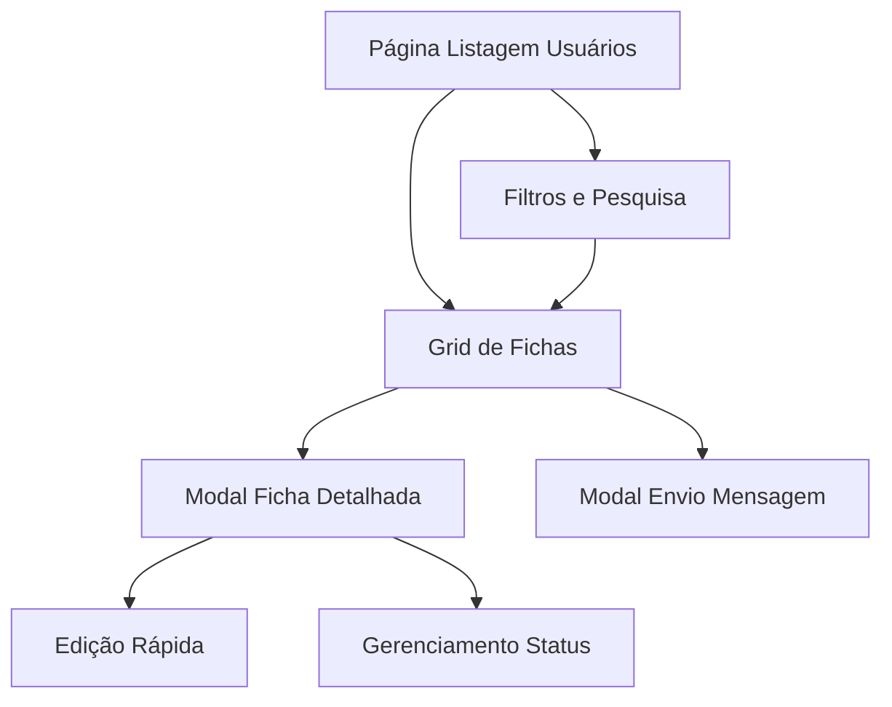

## 1. Visão Geral do Produto
Redesenho da página de administração de usuários para um formato de fichas visuais com foto 3x4, blocos informativos organizados e ações rápidas. O objetivo é melhorar a experiência visual e a usabilidade para administradores que gerenciam usuários do sistema.

- Problema a resolver: interface atual pouco visual e difícil de navegar
- Público-alvo: Administradores do sistema
- Valor: Melhoria significativa na experiência de gestão de usuários

## 2. Funcionalidades Principais

### 2.1 Papéis de Usuário
| Papel | Método de Acesso | Permissões Principais |
|------|-------------------|----------------------|
| Administrador | Login com credenciais | Visualizar, editar, excluir usuários, enviar mensagens |
| Usuário Comum | Login padrão | Visualizar próprio perfil (apenas leitura) |

### 2.2 Módulo de Funcionalidades
A página de administração de usuários consiste nos seguintes elementos principais:
1. **Página de Listagem de Usuários**: grid de fichas com foto 3x4, filtros rápidos, barra de pesquisa
2. **Modal de Ficha Detalhada**: visualização completa do usuário com todas informações
3. **Modal de Envio de Mensagem**: interface para enviar mensagens diretas ao usuário

### 2.3 Detalhes das Páginas
| Nome da Página | Nome do Módulo | Descrição da Funcionalidade |
|----------------|----------------|----------------------------|
| Listagem de Usuários | Grid de Fichas | Exibir usuários em formato de cards com foto 3x4, nome, email, status e botões de ação rápida |
| Listagem de Usuários | Filtros e Pesquisa | Barra lateral com filtros por status, data de cadastro, campo de busca por nome/email |
| Listagem de Usuários | Ações em Lote | Selecionar múltiplos usuários para ações como ativar/desativar, exportar |
| Modal Ficha | Visualização Detalhada | Exibir foto ampliada, dados pessoais completos, histórico de atividades, informações de contato |
| Modal Ficha | Edição Rápida | Permitir edição inline de campos básicos como nome, email, telefone |
| Modal Ficha | Gerenciamento de Status | Alternar status ativo/inativo, resetar senha, definir permissões |
| Modal Mensagem | Composição | Editor de texto simples com preview, seletor de template de mensagem |
| Modal Mensagem | Envio | Enviar email ou notificação push, acompanhar status de entrega |

## 3. Fluxo Principal de Operações

### Fluxo do Administrador
1. Administrador acessa página /admin/users
2. Visualiza grid de fichas com foto 3x4 dos usuários
3. Usa filtros laterais para refinar a visualização
4. Clica em uma ficha para abrir modal detalhado
5. Realiza ações rápidas diretamente na ficha (editar, enviar mensagem)
6. Acessa modal de mensagem para comunicação direta

## 4. Design da Interface

### 4.1 Estilo de Design
- **Cores Primárias**: Azul profissional (#2563EB) para ações principais
- **Cores Secundárias**: Cinza claro (#F3F4F6) para fundos, verde (#10B981) para status ativo
- **Estilo de Botões**: Arredondados com sombra suave, ícones intuitivos
- **Tipografia**: Fonte sans-serif moderna, títulos 16px, corpo 14px
- **Layout**: Card-based com grid responsivo, navegação lateral para filtros
- **Ícones**: Estilo line-icon minimalista, consistente com design system

### 4.2 Visão Geral das Páginas
| Nome da Página | Nome do Módulo | Elementos de UI |
|----------------|----------------|---------------|
| Listagem de Usuários | Grid de Fichas | Cards 300x400px com foto 3x4 (120x160px), nome em negrito, email secundário, badge de status colorido, 3 botões de ação com ícones |
| Listagem de Usuários | Filtros Lateral | Sidebar 250px com collapsible sections, checkboxes para status, date picker para período, campo search com ícone lupa |
| Modal Ficha | Header | Foto ampliada 200x267px, nome em fonte 24px, status toggle switch, botão fechar X |
| Modal Ficha | Corpo | Tabs organizadas: Informações, Atividades, Configurações. Cada tab com cards de informação em grid 2 colunas |
| Modal Mensagem | Composição | Editor textarea 400px altura, preview em tempo real, template dropdown, botão enviar primário |

### 4.3 Responsividade
- Desktop-first: Otimizado para telas 1366px+
- Mobile-adaptativo: Grid adapta para 1 coluna em telas <768px
- Touch-optimized: Botões mínimo 44px para touch, swipe para ações em mobile