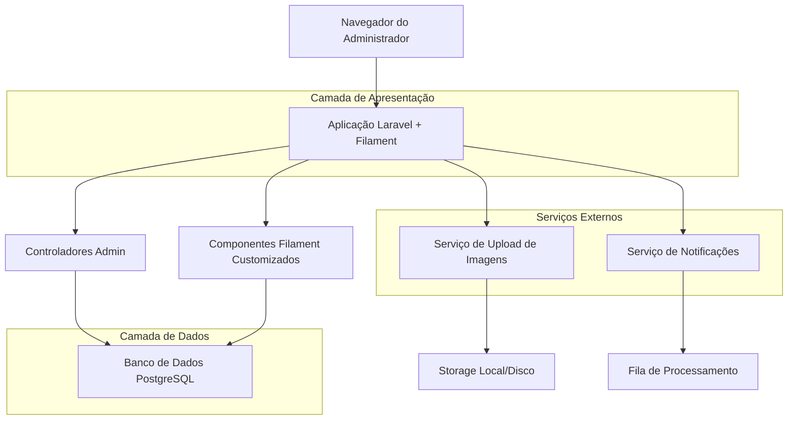
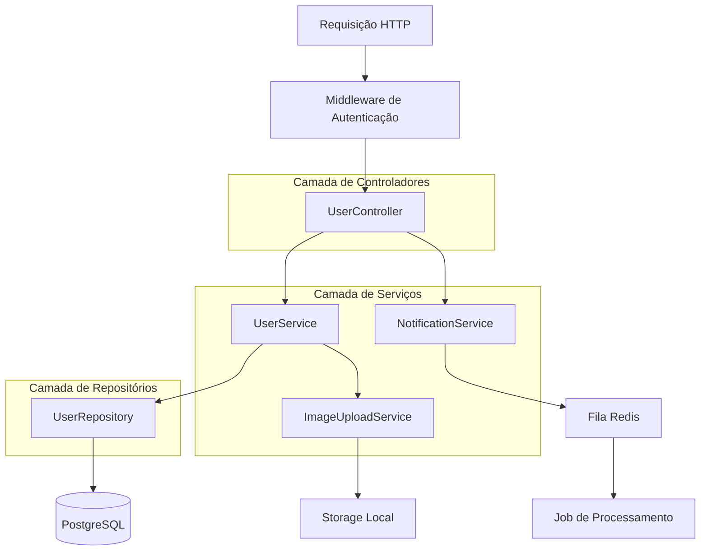
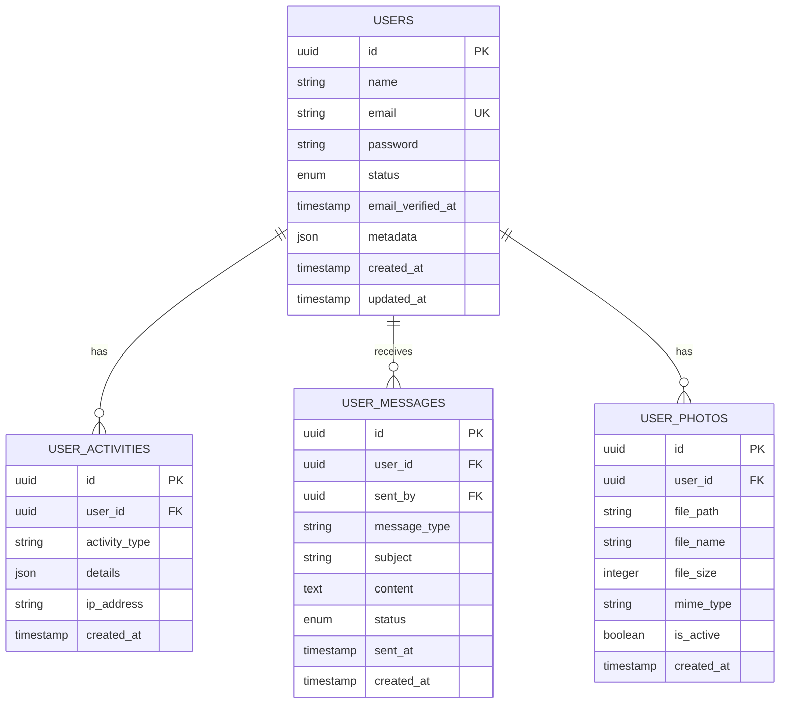

## 1. Arquitetura do Sistema



## 2. Tecnologias Utilizadas

- **Backend**: Laravel 10.x + Filament 3.x
- **Frontend**: Blade Components + Alpine.js + Tailwind CSS
- **Banco de Dados**: PostgreSQL
- **Fila**: Redis para processamento assíncrono
- **Storage**: Sistema de arquivos local para fotos 3x4
- **Inicialização**: Laravel com Sail (Docker)

## 3. Definições de Rotas

| Rota | Finalidade |
|------|------------|
| /admin/users | Página principal listagem de usuários em formato de fichas |
| /admin/users/{id} | Visualização individual de ficha detalhada (via modal) |
| /admin/users/{id}/edit | Formulário de edição rápida |
| /admin/users/bulk-actions | Processamento de ações em lote |
| /admin/users/{id}/send-message | Envio de mensagem direta ao usuário |
| /admin/users/filters | Endpoint AJAX para filtros dinâmicos |

## 4. Definições de API

### 4.1 API de Gerenciamento de Usuários

**Listar usuários com paginação e filtros**
```
GET /api/admin/users
```

Parâmetros:
| Nome do Parâmetro | Tipo | Obrigatório | Descrição |
|-------------------|------|-------------|-----------|
| page | integer | false | Número da página para paginação |
| per_page | integer | false | Itens por página (padrão: 12) |
| search | string | false | Busca por nome ou email |
| status | string | false | Filtrar por status (active, inactive) |
| date_from | date | false | Data inicial do filtro |
| date_to | date | false | Data final do filtro |

Resposta:
```json
{
  "data": [
    {
      "id": "uuid",
      "name": "João Silva",
      "email": "joao@example.com",
      "photo_url": "/storage/users/photos/photo_123.jpg",
      "status": "active",
      "created_at": "2024-01-15T10:00:00Z",
      "last_activity": "2024-12-01T15:30:00Z"
    }
  ],
  "meta": {
    "current_page": 1,
    "total_pages": 5,
    "total_items": 58
  }
}
```

**Enviar mensagem para usuário**
```
POST /api/admin/users/{id}/send-message
```

Parâmetros:
| Nome do Parâmetro | Tipo | Obrigatório | Descrição |
|-------------------|------|-------------|-----------|
| message_type | string | true | Tipo: email ou notification |
| subject | string | true | Assunto da mensagem |
| content | string | true | Conteúdo da mensagem |
| template_id | string | false | ID do template pré-definido |

Resposta:
```json
{
  "success": true,
  "message_id": "msg_123",
  "status": "queued"
}
```

## 5. Arquitetura do Servidor



## 6. Modelo de Dados

### 6.1 Definição do Modelo de Dados



### 6.2 Linguagem de Definição de Dados (DDL)

**Tabela de Usuários (users)**
```sql
-- criar tabela
CREATE TABLE users (
    id UUID PRIMARY KEY DEFAULT gen_random_uuid(),
    name VARCHAR(255) NOT NULL,
    email VARCHAR(255) UNIQUE NOT NULL,
    password VARCHAR(255) NOT NULL,
    status VARCHAR(20) DEFAULT 'active' CHECK (status IN ('active', 'inactive', 'suspended')),
    email_verified_at TIMESTAMP NULL,
    metadata JSONB DEFAULT '{}',
    created_at TIMESTAMP DEFAULT CURRENT_TIMESTAMP,
    updated_at TIMESTAMP DEFAULT CURRENT_TIMESTAMP
);

-- criar índices
CREATE INDEX idx_users_status ON users(status);
CREATE INDEX idx_users_created_at ON users(created_at DESC);
CREATE INDEX idx_users_email ON users(email);

-- criar trigger para updated_at
CREATE OR REPLACE FUNCTION update_updated_at_column()
RETURNS TRIGGER AS $$
BEGIN
    NEW.updated_at = CURRENT_TIMESTAMP;
    RETURN NEW;
END;
$$ language 'plpgsql';

CREATE TRIGGER update_users_updated_at 
    BEFORE UPDATE ON users 
    FOR EACH ROW 
    EXECUTE FUNCTION update_updated_at_column();
```

**Tabela de Atividades dos Usuários (user_activities)**
```sql
CREATE TABLE user_activities (
    id UUID PRIMARY KEY DEFAULT gen_random_uuid(),
    user_id UUID REFERENCES users(id) ON DELETE CASCADE,
    activity_type VARCHAR(50) NOT NULL,
    details JSONB DEFAULT '{}',
    ip_address INET,
    created_at TIMESTAMP DEFAULT CURRENT_TIMESTAMP
);

CREATE INDEX idx_user_activities_user_id ON user_activities(user_id);
CREATE INDEX idx_user_activities_created_at ON user_activities(created_at DESC);
```

**Tabela de Mensagens (user_messages)**
```sql
CREATE TABLE user_messages (
    id UUID PRIMARY KEY DEFAULT gen_random_uuid(),
    user_id UUID REFERENCES users(id) ON DELETE CASCADE,
    sent_by UUID REFERENCES users(id),
    message_type VARCHAR(20) DEFAULT 'email' CHECK (message_type IN ('email', 'notification')),
    subject VARCHAR(255),
    content TEXT NOT NULL,
    status VARCHAR(20) DEFAULT 'pending' CHECK (status IN ('pending', 'sent', 'failed')),
    sent_at TIMESTAMP NULL,
    created_at TIMESTAMP DEFAULT CURRENT_TIMESTAMP
);

CREATE INDEX idx_user_messages_user_id ON user_messages(user_id);
CREATE INDEX idx_user_messages_status ON user_messages(status);
CREATE INDEX idx_user_messages_created_at ON user_messages(created_at DESC);
```

**Tabela de Fotos (user_photos)**
```sql
CREATE TABLE user_photos (
    id UUID PRIMARY KEY DEFAULT gen_random_uuid(),
    user_id UUID REFERENCES users(id) ON DELETE CASCADE,
    file_path VARCHAR(500) NOT NULL,
    file_name VARCHAR(255) NOT NULL,
    file_size INTEGER,
    mime_type VARCHAR(100),
    is_active BOOLEAN DEFAULT true,
    created_at TIMESTAMP DEFAULT CURRENT_TIMESTAMP
);

CREATE INDEX idx_user_photos_user_id ON user_photos(user_id);
CREATE INDEX idx_user_photos_active ON user_photos(is_active);
```

### 6.3 Configurações de Permissões (Supabase-style)

```sql
-- permissões básicas para usuários autenticados
GRANT SELECT ON users TO authenticated;
GRANT SELECT ON user_activities TO authenticated;
GRANT SELECT, INSERT ON user_messages TO authenticated;
GRANT SELECT ON user_photos TO authenticated;

-- permissões completas para administradores
GRANT ALL PRIVILEGES ON users TO authenticated;
GRANT ALL PRIVILEGES ON user_activities TO authenticated;
GRANT ALL PRIVILEGES ON user_messages TO authenticated;
GRANT ALL PRIVILEGES ON user_photos TO authenticated;
```

### 6.4 Dados Iniciais
```sql
-- inserir usuário administrador de exemplo
INSERT INTO users (name, email, password, status, email_verified_at) 
VALUES (
    'Administrador Sistema', 
    'admin@example.com', 
    '$2y$10$92IXUNpkjO0rOQ5byMi.Ye4oKoEa3Ro9llC/.og/at2.uheWG/igi', -- password
    'active',
    CURRENT_TIMESTAMP
);
```