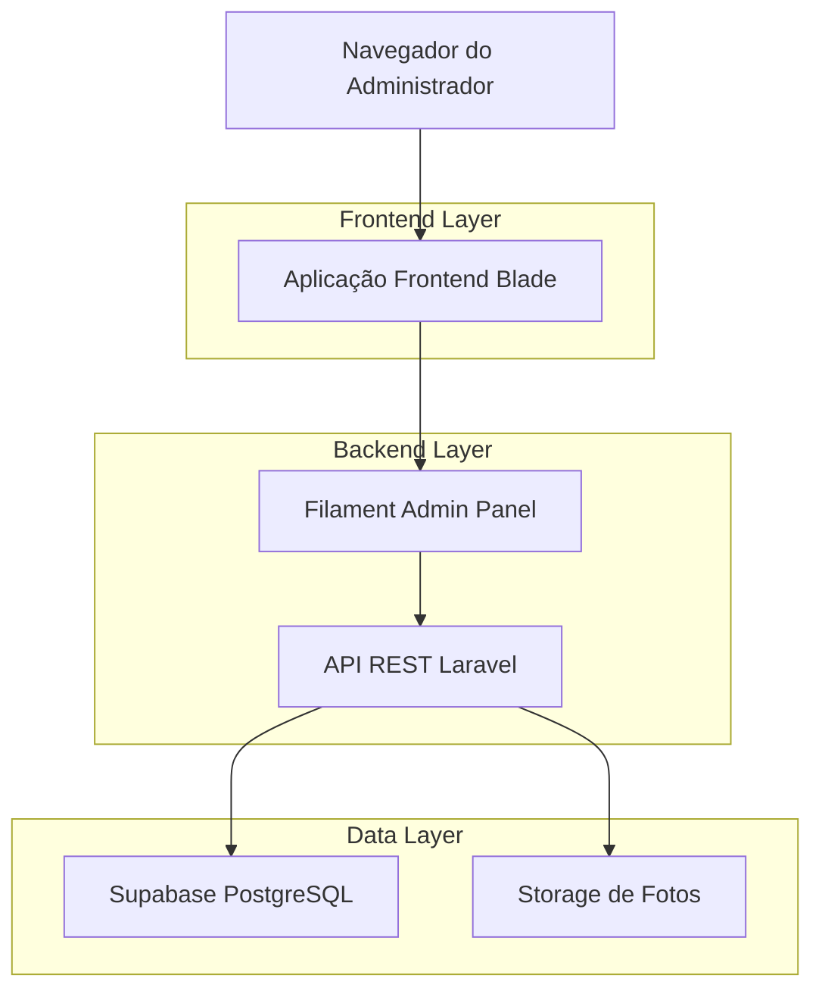
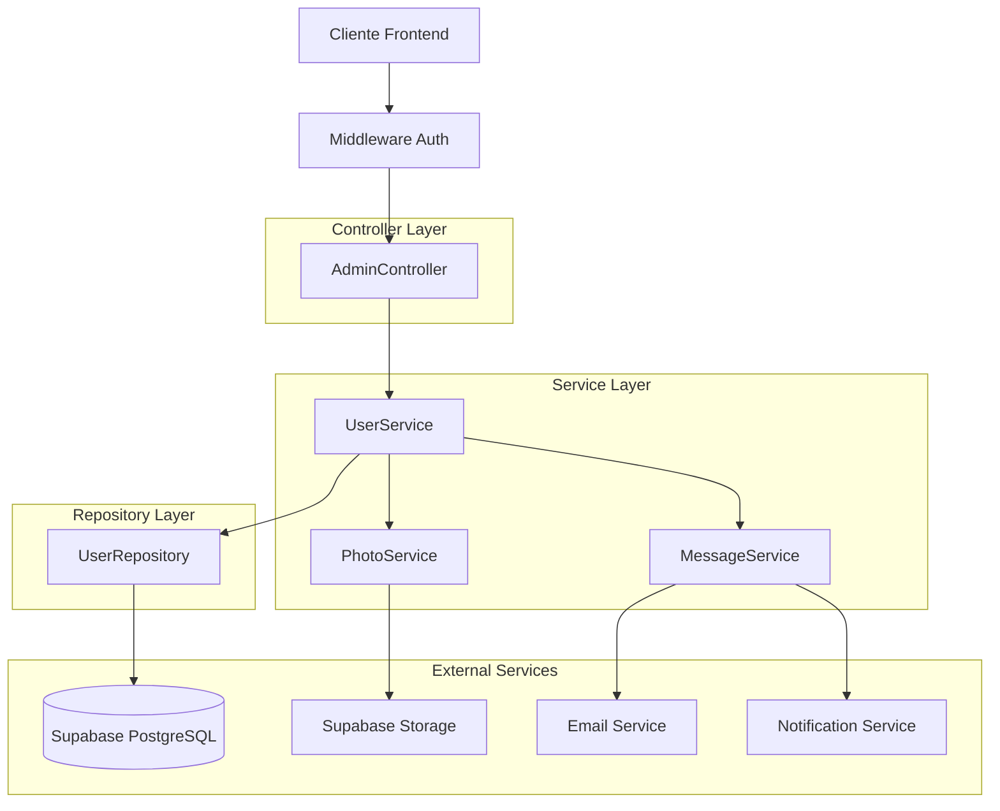
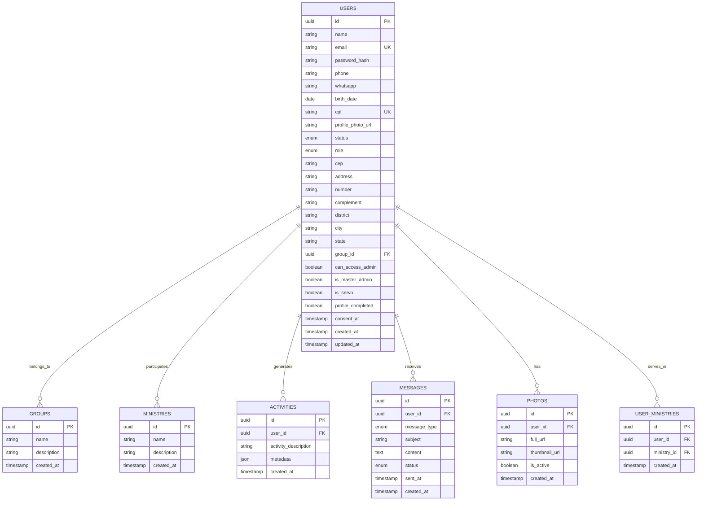

## 1. Arquitetura do Sistema



## 2. Tecnologias Utilizadas

- **Frontend**: Laravel Blade + Filament Admin Panel + TailwindCSS
- **Backend**: Laravel 10 com API REST
- **Banco de Dados**: Supabase PostgreSQL
- **Storage**: Supabase Object Storage para fotos de perfil
- **Autenticação**: Laravel Sanctum para API tokens
- **Estilização**: TailwindCSS 3 com classes customizadas

## 3. Definições de Rotas

| Rota | Método | Propósito |
|------|--------|-----------|
| `/admin/users` | GET | Página principal de gestão de usuários |
| `/api/v1/admin/users` | GET | Listar usuários com filtros e paginação |
| `/api/v1/admin/users/{id}` | GET | Obter detalhes completos de um usuário |
| `/api/v1/admin/users/{id}/send-message` | POST | Enviar mensagem para usuário |
| `/api/v1/admin/users/{id}/upload-photo` | POST | Upload de foto de perfil |

## 4. Definições de API

### 4.1 Listar Usuários
```
GET /api/v1/admin/users
```

**Parâmetros de Requisição:**
| Parâmetro | Tipo | Obrigatório | Descrição |
|-----------|------|-------------|-----------|
| page | integer | false | Número da página (default: 1) |
| per_page | integer | false | Itens por página (default: 12) |
| search | string | false | Busca por nome, email ou telefone |
| status | string | false | Filtrar por status (active/inactive/pending) |
| role | string | false | Filtrar por função (user/admin/leader/servant) |
| group_id | integer | false | Filtrar por ID do grupo |
| can_access_admin | boolean | false | Filtrar por acesso admin |
| is_servo | integer | false | Filtrar apenas servos (1) |

**Resposta de Sucesso (200):**
```json
{
  "users": [
    {
      "id": 1,
      "name": "João Silva",
      "email": "joao@example.com",
      "phone": "+5511999999999",
      "profile_photo_url": "https://storage.supabase.com/photos/user1.jpg",
      "status": "active",
      "role": "admin",
      "group": {
        "id": 1,
        "name": "Grupo Central"
      },
      "ministries": [
        {"id": 1, "name": "Louvor"},
        {"id": 2, "name": "Media"}
      ],
      "activities": [
        {
          "id": 1,
          "activity_description": "Login realizado",
          "created_at": "2025-12-01T10:00:00Z"
        }
      ],
      "created_at": "2025-11-01T00:00:00Z",
      "can_access_admin": true,
      "is_servo": true
    }
  ],
  "pagination": {
    "current_page": 1,
    "last_page": 5,
    "per_page": 12,
    "total": 58
  }
}
```

### 4.2 Obter Detalhes do Usuário
```
GET /api/v1/admin/users/{id}
```

**Resposta de Sucesso (200):**
```json
{
  "user": {
    "id": 1,
    "name": "João Silva",
    "email": "joao@example.com",
    "phone": "+5511999999999",
    "whatsapp": "+5511999999999",
    "birth_date": "1990-01-15",
    "cpf": "123.456.789-00",
    "profile_photo_url": "https://storage.supabase.com/photos/user1.jpg",
    "status": "active",
    "role": "admin",
    "cep": "01234-567",
    "address": "Rua Exemplo",
    "number": "123",
    "complement": "Apto 45",
    "district": "Centro",
    "city": "São Paulo",
    "state": "SP",
    "group": {
      "id": 1,
      "name": "Grupo Central"
    },
    "ministries": [
      {"id": 1, "name": "Louvor"},
      {"id": 2, "name": "Media"}
    ],
    "activities": [...],
    "messages": [...],
    "photos": [...],
    "can_access_admin": true,
    "is_master_admin": false,
    "is_servo": true,
    "created_at": "2025-11-01T00:00:00Z",
    "profile_completed_at": "2025-11-15T00:00:00Z",
    "consent_at": "2025-11-01T00:00:00Z"
  }
}
```

### 4.3 Enviar Mensagem
```
POST /api/v1/admin/users/{id}/send-message
```

**Corpo da Requisição:**
```json
{
  "message_type": "email",
  "subject": "Atualização importante",
  "content": "Olá, gostaríamos de informar..."
}
```

**Resposta de Sucesso (200):**
```json
{
  "success": true,
  "message": "Mensagem enviada com sucesso"
}
```

### 4.4 Upload de Foto
```
POST /api/v1/admin/users/{id}/upload-photo
```

**Corpo da Requisição:** FormData com campo 'photo'

**Resposta de Sucesso (200):**
```json
{
  "success": true,
  "photo": {
    "id": 1,
    "full_url": "https://storage.supabase.com/photos/user1_full.jpg",
    "thumbnail_url": "https://storage.supabase.com/photos/user1_thumb.jpg",
    "is_active": true
  }
}
```

## 5. Arquitetura do Servidor



## 6. Modelo de Dados

### 6.1 Diagrama ER



### 6.2 Definições SQL

**Tabela de Usuários (users)**
```sql
-- Criar tabela
CREATE TABLE users (
    id UUID PRIMARY KEY DEFAULT gen_random_uuid(),
    name VARCHAR(255) NOT NULL,
    email VARCHAR(255) UNIQUE NOT NULL,
    password_hash VARCHAR(255) NOT NULL,
    phone VARCHAR(20),
    whatsapp VARCHAR(20),
    birth_date DATE,
    cpf VARCHAR(14) UNIQUE,
    profile_photo_url TEXT,
    status VARCHAR(20) DEFAULT 'pending' CHECK (status IN ('active', 'inactive', 'pending')),
    role VARCHAR(20) DEFAULT 'user' CHECK (role IN ('user', 'admin', 'leader', 'servant')),
    cep VARCHAR(9),
    address VARCHAR(255),
    number VARCHAR(20),
    complement VARCHAR(100),
    district VARCHAR(100),
    city VARCHAR(100),
    state VARCHAR(2),
    group_id UUID REFERENCES groups(id),
    can_access_admin BOOLEAN DEFAULT false,
    is_master_admin BOOLEAN DEFAULT false,
    is_servo BOOLEAN DEFAULT false,
    profile_completed BOOLEAN DEFAULT false,
    consent_at TIMESTAMP WITH TIME ZONE,
    created_at TIMESTAMP WITH TIME ZONE DEFAULT NOW(),
    updated_at TIMESTAMP WITH TIME ZONE DEFAULT NOW()
);

-- Criar índices
CREATE INDEX idx_users_status ON users(status);
CREATE INDEX idx_users_role ON users(role);
CREATE INDEX idx_users_group_id ON users(group_id);
CREATE INDEX idx_users_can_access_admin ON users(can_access_admin);
CREATE INDEX idx_users_is_servo ON users(is_servo);
CREATE INDEX idx_users_created_at ON users(created_at DESC);
CREATE INDEX idx_users_search ON users(name, email, phone);

-- Permissões Supabase
GRANT SELECT ON users TO anon;
GRANT ALL PRIVILEGES ON users TO authenticated;
```

**Tabela de Grupos (groups)**
```sql
CREATE TABLE groups (
    id UUID PRIMARY KEY DEFAULT gen_random_uuid(),
    name VARCHAR(255) NOT NULL,
    description TEXT,
    created_at TIMESTAMP WITH TIME ZONE DEFAULT NOW()
);

GRANT SELECT ON groups TO anon;
GRANT ALL PRIVILEGES ON groups TO authenticated;
```

**Tabela de Ministérios (ministries)**
```sql
CREATE TABLE ministries (
    id UUID PRIMARY KEY DEFAULT gen_random_uuid(),
    name VARCHAR(255) NOT NULL,
    description TEXT,
    created_at TIMESTAMP WITH TIME ZONE DEFAULT NOW()
);

GRANT SELECT ON ministries TO anon;
GRANT ALL PRIVILEGES ON ministries TO authenticated;
```

**Tabela de Atividades (activities)**
```sql
CREATE TABLE activities (
    id UUID PRIMARY KEY DEFAULT gen_random_uuid(),
    user_id UUID NOT NULL REFERENCES users(id) ON DELETE CASCADE,
    activity_description VARCHAR(255) NOT NULL,
    metadata JSONB DEFAULT '{}',
    created_at TIMESTAMP WITH TIME ZONE DEFAULT NOW()
);

CREATE INDEX idx_activities_user_id ON activities(user_id);
CREATE INDEX idx_activities_created_at ON activities(created_at DESC);

GRANT SELECT ON activities TO anon;
GRANT ALL PRIVILEGES ON activities TO authenticated;
```

**Tabela de Mensagens (messages)**
```sql
CREATE TABLE messages (
    id UUID PRIMARY KEY DEFAULT gen_random_uuid(),
    user_id UUID NOT NULL REFERENCES users(id) ON DELETE CASCADE,
    message_type VARCHAR(20) NOT NULL CHECK (message_type IN ('email', 'notification')),
    subject VARCHAR(255),
    content TEXT NOT NULL,
    status VARCHAR(20) DEFAULT 'sent' CHECK (status IN ('sent', 'delivered', 'failed')),
    sent_at TIMESTAMP WITH TIME ZONE DEFAULT NOW(),
    created_at TIMESTAMP WITH TIME ZONE DEFAULT NOW()
);

CREATE INDEX idx_messages_user_id ON messages(user_id);
CREATE INDEX idx_messages_created_at ON messages(created_at DESC);

GRANT SELECT ON messages TO anon;
GRANT ALL PRIVILEGES ON messages TO authenticated;
```

**Tabela de Fotos (photos)**
```sql
CREATE TABLE photos (
    id UUID PRIMARY KEY DEFAULT gen_random_uuid(),
    user_id UUID NOT NULL REFERENCES users(id) ON DELETE CASCADE,
    full_url TEXT NOT NULL,
    thumbnail_url TEXT NOT NULL,
    is_active BOOLEAN DEFAULT true,
    created_at TIMESTAMP WITH TIME ZONE DEFAULT NOW()
);

CREATE INDEX idx_photos_user_id ON photos(user_id);
CREATE INDEX idx_photos_is_active ON photos(is_active);

GRANT SELECT ON photos TO anon;
GRANT ALL PRIVILEGES ON photos TO authenticated;
```

### 6.3 Dados Iniciais

```sql
-- Inserir grupos padrão
INSERT INTO groups (name, description) VALUES
('Grupo Central', 'Grupo principal da igreja'),
('Grupo Jovem', 'Grupo para jovens de 18-30 anos'),
('Grupo Família', 'Grupo para casais e famílias');

-- Inserir ministérios padrão
INSERT INTO ministries (name, description) VALUES
('Louvor', 'Ministério de louvor e adoração'),
('Media', 'Ministério de comunicação e mídia'),
('Intercessão', 'Ministério de oração e intercessão'),
('Recepção', 'Ministério de recepção e acolhimento'),
('Infantil', 'Ministério infantil');
```