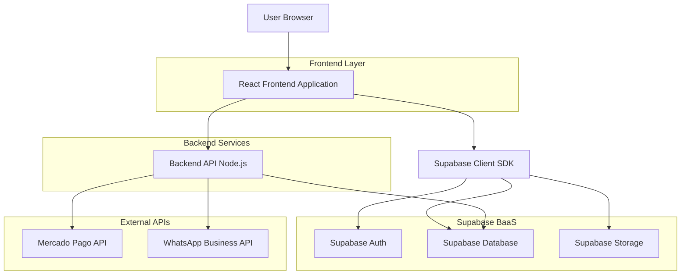
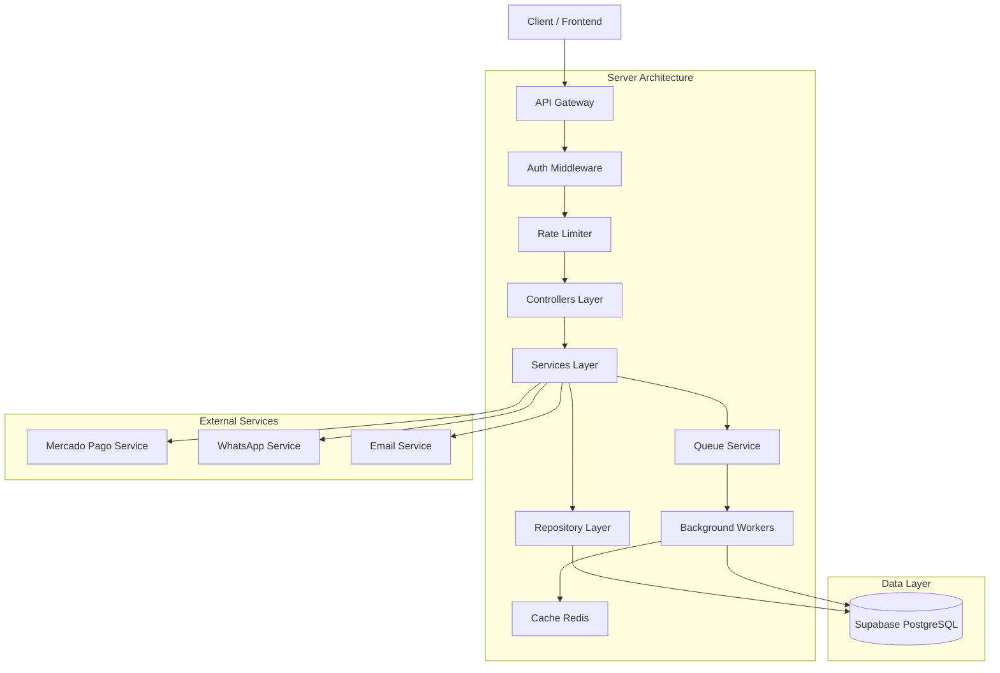
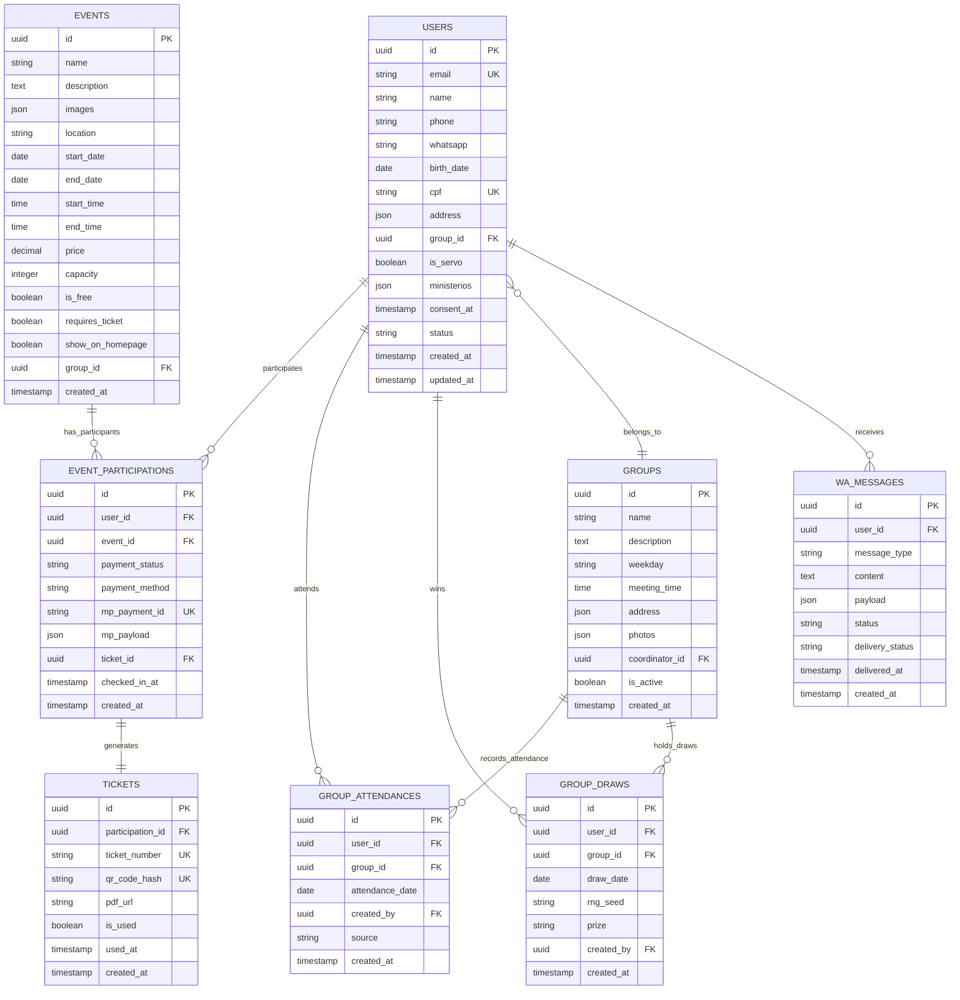

## 1. Architecture design



## 2. Technology Description

### Stack Principal
- **Frontend**: React@18 + TypeScript + Vite
- **Styling**: TailwindCSS@3 + HeadlessUI + Framer Motion
- **Estado Global**: Zustand + React Query (TanStack Query)
- **UI Components**: Shadcn/ui + Radix UI
- **Gráficos**: Recharts + Chart.js
- **PDF Generation**: React PDF + html2canvas
- **Mapas**: React Leaflet
- **Animações**: Framer Motion + Lottie React

### Backend Services
- **Runtime**: Node.js@20 + Express@4
- **ORM**: Prisma + PostgreSQL (Supabase)
- **Autenticação**: Supabase Auth (JWT)
- **Validação**: Zod + Joi
- **Upload**: Multer + Sharp (image processing)
- **Email**: Nodemailer + React Email
- **Queue**: Bull + Redis

### Integrações
- **Pagamentos**: Mercado Pago SDK
- **WhatsApp**: WhatsApp Business Cloud API
- **Storage**: Supabase Storage
- **Analytics**: Mixpanel + Google Analytics 4
- **Error Tracking**: Sentry

### Ferramentas de Desenvolvimento
- **Build**: Vite + SWC
- **Linting**: ESLint + Prettier
- **Testes**: Vitest + React Testing Library
- **Storybook**: Documentação de componentes
- **Docker**: Containerização completa

## 3. Route definitions

### Rotas Públicas
| Route | Purpose |
|-------|---------|
| / | Landing page com hero, eventos, grupos |
| /eventos | Listagem completa de eventos com filtros |
| /eventos/:id | Detalhes do evento com galeria e inscrição |
| /grupos | Mapa e listagem de grupos de oração |
| /grupos/:id | Página individual do grupo com fotos e info |
| /cadastro | Formulário único de cadastro com validação |
| /login | Login com opções sociais e magic link |
| /recuperar-senha | Recuperação de senha via email |

### Rotas Autenticadas (Fiel)
| Route | Purpose |
|-------|---------|
| /dashboard | Visão geral personalizada do fiel |
| /meus-eventos | Lista de eventos inscritos com status |
| /meus-ingressos | Visualização e download de ingressos |
| /perfil | Edição completa do perfil pessoal |
| /meu-grupo | Informações do grupo de oração |
| /configuracoes | Preferências e notificações |

### Rotas Administrativas
| Route | Purpose |
|-------|---------|
| /admin | Dashboard principal com analytics |
| /admin/usuarios | Gestão completa de usuários |
| /admin/eventos | CRUD de eventos com editor visual |
| /admin/grupos | Gestão de grupos e coordenadores |
| /admin/pastoreio | Interface de registro de presenças |
| /admin/relatorios | Relatórios e exportações diversas |
| /admin/configuracoes | Configurações do sistema |
| /admin/integracoes | Mercado Pago, WhatsApp, etc |

### Rotas de API
| Route | Purpose |
|-------|---------|
| /api/auth/* | Endpoints de autenticação Supabase |
| /api/events | CRUD de eventos com paginação |
| /api/groups | Gestão de grupos de oração |
| /api/attendance | Registro de presenças |
| /api/payments | Processamento de pagamentos |
| /api/webhooks/mercadopago | Webhook de pagamentos |
| /api/whatsapp | Envio de mensagens WhatsApp |
| /api/tickets | Geração e validação de ingressos |
| /api/analytics | Dados para dashboards |

## 4. API definitions

### 4.1 Authentication APIs

#### POST /api/auth/register
**Request:**
```json
{
  "name": "João da Silva",
  "email": "joao@email.com",
  "phone": "+5511999999999",
  "whatsapp": "+5511999999999",
  "birth_date": "1990-01-15",
  "cpf": "12345678909",
  "address": {
    "cep": "01234-567",
    "street": "Rua Exemplo",
    "number": "123",
    "complement": "Apto 45",
    "district": "Centro",
    "city": "São Paulo",
    "state": "SP"
  },
  "group_id": "uuid-do-grupo",
  "consent_lgpd": true
}
```

**Response:**
```json
{
  "user": {
    "id": "uuid-gerado",
    "email": "joao@email.com",
    "name": "João da Silva"
  },
  "session": {
    "access_token": "jwt-token",
    "refresh_token": "refresh-token",
    "expires_in": 3600
  }
}
```

### 4.2 Event APIs

#### GET /api/events
**Query Parameters:**
| Param | Type | Required | Description |
|-------|------|----------|-------------|
| page | number | false | Página para paginação |
| limit | number | false | Itens por página (default: 20) |
| start_date | string | false | Filtrar eventos a partir desta data |
| end_date | string | false | Filtrar eventos até esta data |
| is_free | boolean | false | Filtrar apenas eventos gratuitos/pagos |
| group_id | string | false | Filtrar por grupo de oração |

**Response:**
```json
{
  "data": [
    {
      "id": "event-uuid",
      "name": "Retiro Espiritual",
      "description": "Descrição completa do evento...",
      "start_date": "2024-02-15",
      "end_date": "2024-02-17",
      "location": "Centro de Eventos",
      "price": 150.00,
      "capacity": 200,
      "registered_count": 145,
      "images": ["url1", "url2"],
      "group_id": "group-uuid",
      "created_at": "2024-01-01T00:00:00Z"
    }
  ],
  "pagination": {
    "page": 1,
    "limit": 20,
    "total": 45,
    "total_pages": 3
  }
}
```

#### POST /api/events/:id/participate
**Request:**
```json
{
  "user_id": "user-uuid",
  "payment_method": "pix" // pix, card, boleto
}
```

**Response:**
```json
{
  "participation_id": "participation-uuid",
  "payment_status": "pending",
  "payment_link": "https://mercadopago.com/...",
  "qr_code": "base64-qrcode",
  "expires_at": "2024-02-10T23:59:59Z"
}
```

### 4.3 Payment APIs

#### POST /api/payments/process
**Request:**
```json
{
  "participation_id": "participation-uuid",
  "payment_method": "card",
  "card_data": {
    "card_number": "4111111111111111",
    "cardholder_name": "JOAO SILVA",
    "expiry_month": 12,
    "expiry_year": 2025,
    "cvv": "123",
    "cpf": "12345678909"
  }
}
```

**Response:**
```json
{
  "payment_id": "payment-uuid",
  "status": "approved",
  "ticket_id": "ticket-uuid",
  "ticket_url": "/api/tickets/uuid/download",
  "message_sent": true
}
```

#### POST /api/webhooks/mercadopago
**Headers:**
- `x-signature`: Verificação de autenticidade
- `x-request-id`: ID único do webhook

**Payload:**
```json
{
  "id": 123456789,
  "live_mode": true,
  "type": "payment",
  "date_created": "2024-01-15T10:00:00Z",
  "application_id": "app-id",
  "user_id": "user-id",
  "version": 1,
  "api_version": "v1",
  "action": "payment.updated",
  "data": {
    "id": "payment-id"
  }
}
```

### 4.4 Attendance APIs

#### POST /api/attendance/register
**Request:**
```json
{
  "user_id": "user-uuid",
  "group_id": "group-uuid",
  "date": "2024-01-15",
  "source": "manual" // manual, qr_code, app
}
```

**Response:**
```json
{
  "attendance_id": "attendance-uuid",
  "user": {
    "name": "João da Silva",
    "photo_url": "https://...",
    "attendance_count": 15,
    "last_attendance": "2024-01-08"
  },
  "streak": 3,
  "message": "Presença registrada com sucesso!"
}
```

#### GET /api/attendance/analytics
**Query Parameters:**
| Param | Type | Required | Description |
|-------|------|----------|-------------|
| group_id | string | false | ID do grupo específico |
| start_date | string | true | Data inicial do período |
| end_date | string | true | Data final do período |
| view | string | false | Tipo de visualização: daily, weekly, monthly |

**Response:**
```json
{
  "overview": {
    "total_attendances": 450,
    "unique_participants": 120,
    "average_per_day": 32,
    "growth_rate": 15.5
  },
  "charts": {
    "daily_attendance": [
      {"date": "2024-01-01", "count": 45},
      {"date": "2024-01-02", "count": 38}
    ],
    "heatmap": [
      {"day": "Domingo", "hour": 19, "count": 45},
      {"day": "Quarta", "hour": 20, "count": 38}
    ]
  },
  "rankings": {
    "top_participants": [
      {"user_id": "uuid", "name": "João", "count": 45},
      {"user_id": "uuid", "name": "Maria", "count": 42}
    ]
  }
}
```

## 5. Server architecture diagram



## 6. Data model

### 6.1 Data model definition



### 6.2 Data Definition Language

#### Users Table
```sql
-- Create users table
CREATE TABLE users (
    id UUID PRIMARY KEY DEFAULT gen_random_uuid(),
    email VARCHAR(255) UNIQUE NOT NULL,
    name VARCHAR(255) NOT NULL,
    phone VARCHAR(20) NOT NULL,
    whatsapp VARCHAR(20),
    birth_date DATE,
    cpf VARCHAR(11) UNIQUE,
    address JSONB,
    group_id UUID REFERENCES groups(id),
    is_servo BOOLEAN DEFAULT false,
    ministerios JSONB DEFAULT '[]',
    consent_at TIMESTAMP WITH TIME ZONE,
    status VARCHAR(20) DEFAULT 'active' CHECK (status IN ('active', 'inactive', 'pending')),
    profile_completed_at TIMESTAMP WITH TIME ZONE,
    created_at TIMESTAMP WITH TIME ZONE DEFAULT NOW(),
    updated_at TIMESTAMP WITH TIME ZONE DEFAULT NOW()
);

-- Create indexes
CREATE INDEX idx_users_email ON users(email);
CREATE INDEX idx_users_cpf ON users(cpf);
CREATE INDEX idx_users_group_id ON users(group_id);
CREATE INDEX idx_users_status ON users(status);
CREATE INDEX idx_users_created_at ON users(created_at DESC);

-- Grant permissions (Supabase)
GRANT SELECT ON users TO anon;
GRANT ALL PRIVILEGES ON users TO authenticated;
```

#### Events Table
```sql
-- Create events table
CREATE TABLE events (
    id UUID PRIMARY KEY DEFAULT gen_random_uuid(),
    name VARCHAR(255) NOT NULL,
    description TEXT,
    images JSONB DEFAULT '[]',
    location VARCHAR(255) NOT NULL,
    start_date DATE NOT NULL,
    end_date DATE NOT NULL,
    start_time TIME,
    end_time TIME,
    price DECIMAL(10,2) DEFAULT 0,
    capacity INTEGER,
    is_free BOOLEAN DEFAULT true,
    requires_ticket BOOLEAN DEFAULT false,
    show_on_homepage BOOLEAN DEFAULT true,
    group_id UUID REFERENCES groups(id),
    created_by UUID REFERENCES users(id),
    created_at TIMESTAMP WITH TIME ZONE DEFAULT NOW(),
    updated_at TIMESTAMP WITH TIME ZONE DEFAULT NOW()
);

-- Create indexes
CREATE INDEX idx_events_start_date ON events(start_date);
CREATE INDEX idx_events_is_free ON events(is_free);
CREATE INDEX idx_events_show_on_homepage ON events(show_on_homepage);
CREATE INDEX idx_events_group_id ON events(group_id);

-- Grant permissions (Supabase)
GRANT SELECT ON events TO anon;
GRANT ALL PRIVILEGES ON events TO authenticated;
```

#### Event Participations Table
```sql
-- Create event participations table
CREATE TABLE event_participations (
    id UUID PRIMARY KEY DEFAULT gen_random_uuid(),
    user_id UUID NOT NULL REFERENCES users(id) ON DELETE CASCADE,
    event_id UUID NOT NULL REFERENCES events(id) ON DELETE CASCADE,
    payment_status VARCHAR(20) DEFAULT 'pending' CHECK (payment_status IN ('pending', 'approved', 'rejected', 'cancelled', 'refunded')),
    payment_method VARCHAR(20) CHECK (payment_method IN ('pix', 'card', 'boleto')),
    mp_payment_id VARCHAR(100) UNIQUE,
    mp_payload JSONB,
    ticket_id UUID REFERENCES tickets(id),
    checked_in_at TIMESTAMP WITH TIME ZONE,
    created_at TIMESTAMP WITH TIME ZONE DEFAULT NOW(),
    UNIQUE(user_id, event_id)
);

-- Create indexes
CREATE INDEX idx_participations_user_id ON event_participations(user_id);
CREATE INDEX idx_participations_event_id ON event_participations(event_id);
CREATE INDEX idx_participations_payment_status ON event_participations(payment_status);
CREATE INDEX idx_participations_created_at ON event_participations(created_at DESC);

-- Grant permissions (Supabase)
GRANT SELECT ON event_participations TO anon;
GRANT ALL PRIVILEGES ON event_participations TO authenticated;
```

#### Tickets Table
```sql
-- Create tickets table
CREATE TABLE tickets (
    id UUID PRIMARY KEY DEFAULT gen_random_uuid(),
    participation_id UUID NOT NULL UNIQUE REFERENCES event_participations(id) ON DELETE CASCADE,
    ticket_number VARCHAR(20) UNIQUE NOT NULL,
    qr_code_hash VARCHAR(64) UNIQUE NOT NULL,
    pdf_url VARCHAR(500),
    is_used BOOLEAN DEFAULT false,
    used_at TIMESTAMP WITH TIME ZONE,
    created_at TIMESTAMP WITH TIME ZONE DEFAULT NOW()
);

-- Create indexes
CREATE INDEX idx_tickets_participation_id ON tickets(participation_id);
CREATE INDEX idx_tickets_ticket_number ON tickets(ticket_number);
CREATE INDEX idx_tickets_qr_code_hash ON tickets(qr_code_hash);
CREATE INDEX idx_tickets_is_used ON tickets(is_used);

-- Grant permissions (Supabase)
GRANT SELECT ON tickets TO anon;
GRANT ALL PRIVILEGES ON tickets TO authenticated;
```

#### Group Attendances Table
```sql
-- Create group attendances table
CREATE TABLE group_attendances (
    id UUID PRIMARY KEY DEFAULT gen_random_uuid(),
    user_id UUID NOT NULL REFERENCES users(id) ON DELETE CASCADE,
    group_id UUID NOT NULL REFERENCES groups(id) ON DELETE CASCADE,
    attendance_date DATE NOT NULL,
    created_by UUID REFERENCES users(id),
    source VARCHAR(20) DEFAULT 'manual' CHECK (source IN ('manual', 'qr_code', 'app')),
    created_at TIMESTAMP WITH TIME ZONE DEFAULT NOW(),
    UNIQUE(user_id, group_id, attendance_date)
);

-- Create indexes
CREATE INDEX idx_attendances_user_id ON group_attendances(user_id);
CREATE INDEX idx_attendances_group_id ON group_attendances(group_id);
CREATE INDEX idx_attendances_attendance_date ON group_attendances(attendance_date);
CREATE INDEX idx_attendances_created_at ON group_attendances(created_at DESC);

-- Grant permissions (Supabase)
GRANT SELECT ON group_attendances TO anon;
GRANT ALL PRIVILEGES ON group_attendances TO authenticated;
```

#### RLS Policies (Supabase)
```sql
-- Enable RLS
ALTER TABLE users ENABLE ROW LEVEL SECURITY;
ALTER TABLE events ENABLE ROW LEVEL SECURITY;
ALTER TABLE event_participations ENABLE ROW LEVEL SECURITY;
ALTER TABLE tickets ENABLE ROW LEVEL SECURITY;
ALTER TABLE group_attendances ENABLE ROW LEVEL SECURITY;

-- Users policies
CREATE POLICY "Users can view active users" ON users FOR SELECT USING (status = 'active');
CREATE POLICY "Users can update own profile" ON users FOR UPDATE USING (auth.uid() = id);
CREATE POLICY "Admins can manage all users" ON users FOR ALL USING (is_admin() = true);

-- Events policies
CREATE POLICY "Anyone can view public events" ON events FOR SELECT USING (show_on_homepage = true);
CREATE POLICY "Admins can manage events" ON events FOR ALL USING (is_admin() = true);

-- Participations policies
CREATE POLICY "Users can view own participations" ON event_participations FOR SELECT USING (user_id = auth.uid());
CREATE POLICY "Users can create participations" ON event_participations FOR INSERT WITH CHECK (user_id = auth.uid());
CREATE POLICY "Admins can view all participations" ON event_participations FOR SELECT USING (is_admin() = true);

-- Attendance policies
CREATE POLICY "Users can view own attendance" ON group_attendances FOR SELECT USING (user_id = auth.uid());
CREATE POLICY "Servos can manage attendance" ON group_attendances FOR ALL USING (is_servant()