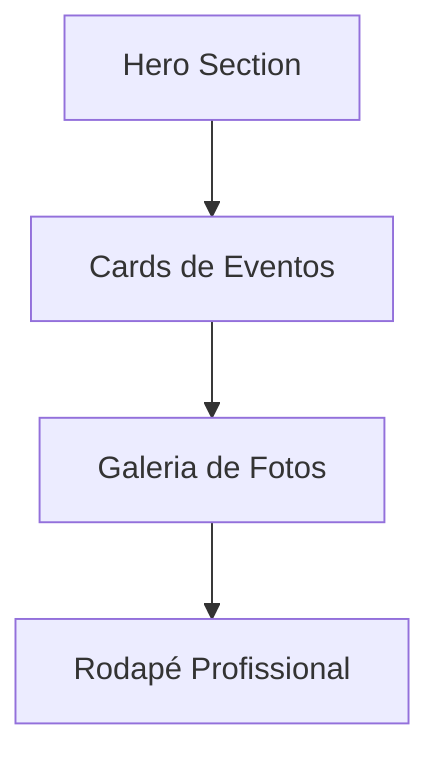

## 1. Product Overview
Homepage moderna e profissional para site católico com identidade visual verde, apresentando seções hero, eventos, galeria e rodapé profissional. O site visa atrair e engajar a comunidade católica com design contemporâneo e conteúdo inspirador.

## 2. Core Features

### 2.2 Feature Module
A homepage moderna consiste nos seguintes elementos principais:
1. **Hero Section**: Banner principal com chamada inspiradora e botão de ação.
2. **Cards de Eventos**: Seção destacando próximos eventos da paróquia.
3. **Galeria de Fotos**: Grid responsivo com imagens das atividades comunitárias.
4. **Rodapé Profissional**: Informações de contato, links úteis e redes sociais.

### 2.3 Page Details
| Page Name | Module Name | Feature description |
|-----------|-------------|---------------------|
| Homepage | Hero Section | Apresentar banner principal com mensagem católica inspiradora, botão de chamada para ação destacado em verde, imagem de fundo simbólica ou gradiente verde suave. |
| Homepage | Cards de Eventos | Exibir próximos eventos em cards responsivos com data, título, breve descrição e ícone representativo, hover effects sutis com transições verdes. |
| Homepage | Galeria de Fotos | Grid de imagens das atividades paroquiais com efeito de hover, lightbox para visualização ampliada, navegação intuitiva entre fotos. |
| Homepage | Navegação Header | Menu superior fixo com logo, links principais (Início, Sobre, Eventos, Contato), design minimalista com fundo branco/translúcido e detalhes verdes. |
| Homepage | Rodapé Profissional | Seção final com informações institucionais, horários de missa, contato, mapa do site, ícones de redes sociais, design coeso com tema verde. |

## 3. Core Process
O usuário acessa a homepage e visualiza imediatamente o hero section com mensagem inspiradora. Ao scrollar, encontra os cards de eventos para se manter informado sobre as atividades. A galeria de fotos mostra momentos da comunidade, incentivando a participação. O rodapé fornece todas as informações de contato necessárias.

## 4. User Interface Design

### 4.1 Design Style
- **Cores Primárias**: Verde católico (#2E8B57, #228B22) com branco e cinzas suaves
- **Cores Secundárias**: Dourado sutil (#DAA520) para detalhes e acentos
- **Botões**: Estilo moderno com bordas arredondadas, hover effects verdes, sombras sutis
- **Tipografia**: Fonte serifada elegante para títulos (ex: Playfair Display), sans-serif moderna para corpo (ex: Inter, Roboto)
- **Layout**: Card-based design com espaçamento generoso, grid responsivo
- **Ícones**: Estilo line-art minimalista em verde ou branco, ícones católicos tradicionais (cruz, lírio, colombas)

### 4.2 Page Design Overview
| Page Name | Module Name | UI Elements |
|-----------|-------------|-------------|
| Hero Section | Banner Principal | Imagem de fundo com overlay escuro 50%, texto branco centralizado, botão verde prominente com ícone, navegação superior fixa com logo. |
| Cards Eventos | Grid Responsivo | Cards brancos com borda verde sutil, ícones de calendário e relógio, títulos em verde escuro, descrições em cinza, botões "Saiba Mais" verdes. |
| Galeria Fotos | Masonry Grid | Imagens quadradas/retangulares com hover overlay verde translúcido, ícone de zoom, bordas arredondadas sutis, lazy loading para performance. |
| Rodapé | Informações | Background verde escuro, texto branco, ícones de redes sociais circulares, separadores visuais, layout em colunas responsivo. |

### 4.3 Responsiveness
Desktop-first com adaptação total para mobile. Menu hamburger em telas pequenas, cards empilhados verticalmente, galeria com 1-2 colunas em mobile. Touch-optimized com botões grandes e espaçamento adequado para dedos.

### 4.4 Elementos Visuais Católicos
- Ícones simbólicos: cruz, lírios, colombas, coração sagrado
- Imagens: fotos de missas, eventos comunitários, espaços da igreja
- Gradientes suaves verdes inspirados na natureza e criação
- Tipografia que transmite serenidade e tradição