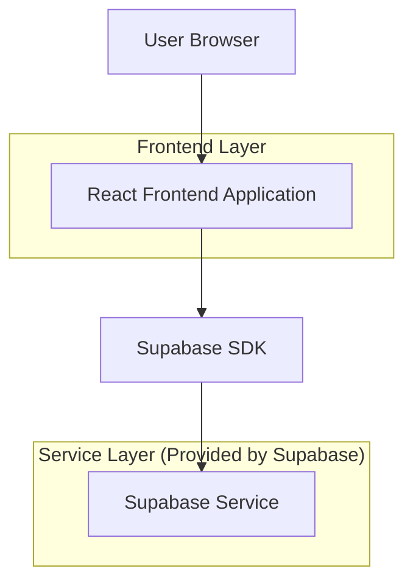
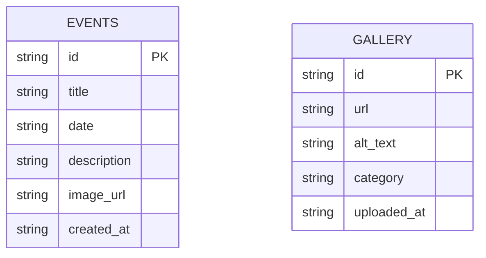

## 1. Architecture design



## 2. Technology Description
- Frontend: React@18 + tailwindcss@3 + vite
- Initialization Tool: vite-init
- Backend: Supabase (para galeria de fotos e eventos)
- Bibliotecas de UI: lucide-react (ícones), framer-motion (animações)

## 3. Route definitions
| Route | Purpose |
|-------|---------|
| / | Homepage principal com todas as seções |

## 4. API definitions

### 4.1 Core API - Eventos
```
GET /api/events
```

Response:
| Param Name| Param Type  | Description |
|-----------|-------------|-------------|
| id    | string     | Event ID |
| title | string     | Event title |
| date  | string     | Event date |
| description | string | Event description |
| image_url | string | Event image URL |

Example
```json
{
  "events": [
    {
      "id": "1",
      "title": "Missa Especial",
      "date": "2024-12-15",
      "description": "Missa festiva com coro",
      "image_url": "/images/event1.jpg"
    }
  ]
}
```

### 4.2 Core API - Galeria
```
GET /api/gallery
```

Response:
| Param Name| Param Type  | Description |
|-----------|-------------|-------------|
| images | array     | Array de objetos de imagem |
| url    | string    | Image URL |
| alt    | string    | Alt text |

## 6. Data model

### 6.1 Data model definition


### 6.2 Data Definition Language

Events Table (events)
```sql
-- create table
CREATE TABLE events (
    id UUID PRIMARY KEY DEFAULT gen_random_uuid(),
    title VARCHAR(255) NOT NULL,
    date DATE NOT NULL,
    description TEXT,
    image_url VARCHAR(500),
    created_at TIMESTAMP WITH TIME ZONE DEFAULT NOW()
);

-- create index
CREATE INDEX idx_events_date ON events(date DESC);
CREATE INDEX idx_events_created_at ON events(created_at DESC);

-- grant permissions
GRANT SELECT ON events TO anon;
GRANT ALL PRIVILEGES ON events TO authenticated;
```

Gallery Table (gallery_images)
```sql
-- create table
CREATE TABLE gallery_images (
    id UUID PRIMARY KEY DEFAULT gen_random_uuid(),
    url VARCHAR(500) NOT NULL,
    alt_text VARCHAR(255),
    category VARCHAR(100) DEFAULT 'general',
    uploaded_at TIMESTAMP WITH TIME ZONE DEFAULT NOW()
);

-- create index
CREATE INDEX idx_gallery_category ON gallery_images(category);
CREATE INDEX idx_gallery_uploaded_at ON gallery_images(uploaded_at DESC);

-- grant permissions
GRANT SELECT ON gallery_images TO anon;
GRANT ALL PRIVILEGES ON gallery_images TO authenticated;
```

## 7. Component Structure

### 7.1 React Components
- `HeroSection`: Banner principal com animações
- `EventCards`: Grid de cards de eventos
- `PhotoGallery`: Galeria responsiva com lightbox
- `ProfessionalFooter`: Rodapé completo com informações
- `NavigationHeader`: Header fixo com menu responsivo

### 7.2 Estilos CSS
- Tailwind CSS com configuração customizada para cores verdes católicas
- Animações suaves com framer-motion
- Responsividade mobile-first
- Dark mode opcional para acessibilidade