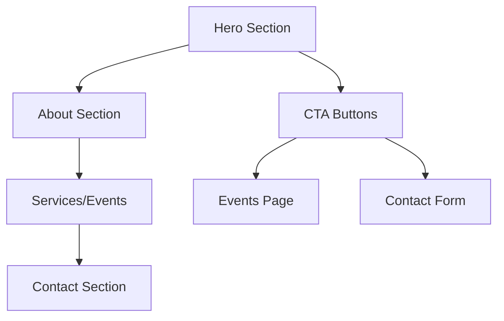

## 1. Product Overview
Landing page profissional para o site da RCC com design moderno e apelo visual. A página apresenta a identidade da marca com elementos visuais impactantes e chamadas para ação claras.

- **Objetivo**: Criar primeira impressão profissional e converter visitantes em leads
- **Público**: Clientes potenciais interessados em eventos e serviços da RCC
- **Valor**: Estabelecer credibilidade e facilitar o contato para negócios

## 2. Core Features

### 2.1 User Roles
| Role | Registration Method | Core Permissions |
|------|---------------------|------------------|
| Visitor | No registration required | View all content, access contact forms |

### 2.2 Feature Module
Landing page da RCC com os seguintes elementos essenciais:
1. **Hero Section**: Imagem de destaque, headline impactante, subtítulo e botões de CTA
2. **About Section**: Breve apresentação da empresa com fotos
3. **Services/Events**: Showcase de serviços ou eventos principais
4. **Contact Section**: Formulário de contato e informações de contato
5. **Footer**: Links sociais e informações adicionais

### 2.3 Page Details
| Page Name | Module Name | Feature description |
|-----------|-------------|---------------------|
| Landing Page | Hero Section | Exibir imagem de alta qualidade como background, título principal chamativo com animação suave, subtítulo descritivo, dois botões CTA prominentes ("Nossos Eventos" e "Entre em Contato") com hover effects |
| Landing Page | Navigation | Menu fixo no topo que muda de cor ao scroll, logo da RCC, links âncora para seções, menu mobile hambúrguer para responsividade |
| Landing Page | About Section | Grid com 2-3 fotos da empresa/equipe, texto descritivo sobre a RCC, ícones visuais representativos, layout alternado foto-texto |
| Landing Page | Services/Events | Cards responsivos com imagens de eventos/serviços, títulos e descrições breves, efeito hover com zoom suave nas imagens |
| Landing Page | Contact Form | Campos para nome, email, telefone e mensagem, validação em tempo real, botão submit com loading state, confirmação de envio |
| Landing Page | Footer | Logo da RCC, links para redes sociais (ícones), informações de contato, copyright notice, link para política de privacidade |

## 3. Core Process
**Visitor Flow**:
1. Usuário acessa a landing page
2. Visualiza hero section com imagem impactante
3. Faz scroll para explorar sobre a empresa
4. Conhece serviços/eventos oferecidos
5. Usa formulário de contato ou clica em CTA
6. É direcionado para página de eventos ou confirmação de contato

## 4. User Interface Design

### 4.1 Design Style
- **Cores Primárias**: Verde (#2E8B57 - Sea Green) e Dourado (#FFD700 - Gold)
- **Cores Secundárias**: Branco (#FFFFFF) e Cinza escuro (#2C3E50) para texto
- **Botões**: Estilo moderno com bordas arredondadas (8px), sombra sutil e gradiente nos CTA
- **Tipografia**: Fonte moderna sans-serif (Inter ou Roboto), títulos 48-64px, texto 16-18px
- **Layout**: Baseado em cards e seções com espaçamento generoso, grid system de 12 colunas
- **Ícones**: Estilo outline minimalista, cor dourada para destaque

### 4.2 Page Design Overview
| Page Name | Module Name | UI Elements |
|-----------|-------------|-------------|
| Hero Section | Background | Imagem full-screen com overlay semi-transparente (rgba(46,139,87,0.7)), foto de alta resolução de evento ou equipe |
| Hero Section | Typography | Título 64px bold em branco, subtítulo 24px regular, máximo 60 caracteres por linha |
| Hero Section | CTA Buttons | Dois botões lado a lado, primário verde com hover dourado, secundário outline branco, 16px padding vertical |
| About Section | Photo Grid | Imagens 300x300px com border-radius 12px, sombra box-shadow suave, layout masonry |
| Services Cards | Card Design | Largura 350px, altura automática, imagem 200px, padding 24px, hover scale 1.05 transform |
| Contact Form | Input Fields | Largura 100% em mobile, 48px altura, borda 2px cinza claro, focus state verde, labels flutuantes |

### 4.3 Responsiveness
- **Desktop-first**: Design otimizado para telas 1920px, breakpoints em 1200px, 768px, 480px
- **Mobile**: Menu hambúrguer, cards empilhados verticalmente, fontes reduzidas em 20%, CTA full-width
- **Touch optimization**: Botões mínimo 44px altura, espaçamento entre elementos 16px mínimo

### 4.4 Performance & Assets
- **Imagens**: Otimizadas WebP, lazy loading, max 200KB por imagem, CDN se possível
- **Animações**: CSS animations apenas, duração 0.3s, easing cubic-bezier(0.4, 0, 0.2, 1)
- **Loading**: Skeleton screens para imagens, spinner mínimo