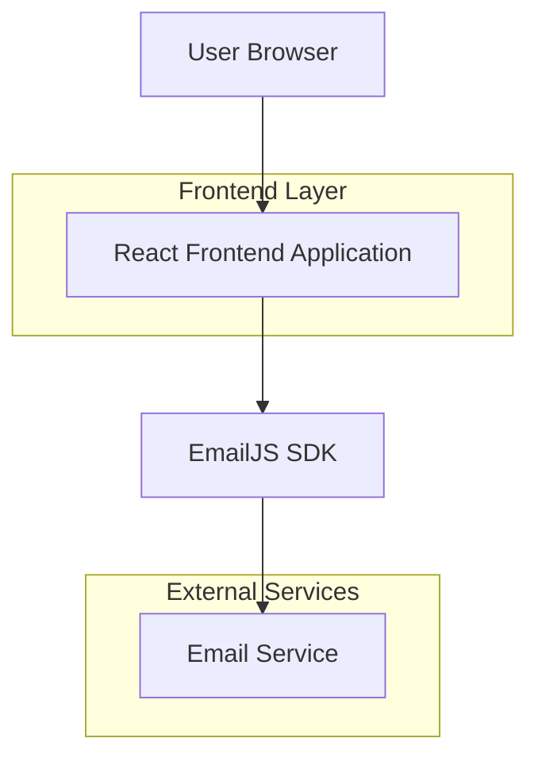

## 1. Architecture design



## 2. Technology Description
- Frontend: React@18 + tailwindcss@3 + vite
- Initialization Tool: vite-init
- Backend: None (static site com EmailJS para formulário)
- Deploy: Vercel/Netlify (static hosting)

## 3. Route definitions
| Route | Purpose |
|-------|---------|
| / | Landing page principal com todas as seções |
| /#about | Ancora para seção sobre (scroll suave) |
| /#services | Ancora para seção serviços/eventos |
| /#contact | Ancora para seção contato |

## 4. Component Structure

### 4.1 Core Components
```typescript
interface HeroProps {
  title: string;
  subtitle: string;
  backgroundImage: string;
  ctaButtons: Array<{
    text: string;
    href: string;
    variant: 'primary' | 'secondary';
  }>;
}

interface ContactFormData {
  name: string;
  email: string;
  phone: string;
  message: string;
}

interface ServiceCardProps {
  image: string;
  title: string;
  description: string;
}
```

### 4.2 Dependencies
```json
{
  "dependencies": {
    "react": "^18.2.0",
    "react-dom": "^18.2.0",
    "react-intersection-observer": "^9.5.2",
    "emailjs-com": "^3.2.0",
    "lucide-react": "^0.263.1"
  },
  "devDependencies": {
    "@types/react": "^18.2.15",
    "@types/react-dom": "^18.2.7",
    "@vitejs/plugin-react": "^4.0.3",
    "autoprefixer": "^10.4.14",
    "postcss": "^8.4.27",
    "tailwindcss": "^3.3.3",
    "typescript": "^5.0.2",
    "vite": "^4.4.5"
  }
}
```

## 5. Performance Optimization

### 5.1 Image Optimization
- Implementar lazy loading com Intersection Observer
- Usar srcset para imagens responsivas
- Comprimir imagens para < 200KB cada
- Converter para WebP com fallback para JPEG

### 5.2 Bundle Size
- Code splitting por seções
- Lazy load de componentes não-críticos
- Tree shaking de dependências não utilizadas
- Minificação de CSS e JavaScript

### 5.3 Caching Strategy
- Cache estático de 1 ano para assets
- Cache de 1 hora para HTML
- Service worker para offline básico
- Preload de fontes críticas

## 6. SEO & Meta Tags

### 6.1 Meta Tags Essenciais
```html
<meta name="description" content="RCC - Soluções completas para eventos corporativos e sociais">
<meta property="og:title" content="RCC - Eventos Profissionais">
<meta property="og:description" content="Transformamos seu evento em experiências inesquecíveis">
<meta property="og:image" content="/og-image.jpg">
<meta property="og:type" content="website">
<meta name="twitter:card" content="summary_large_image">
```

### 6.2 Schema.org
```json
{
  "@context": "https://schema.org",
  "@type": "LocalBusiness",
  "name": "RCC",
  "description": "Eventos corporativos e sociais",
  "telephone": "+55-XX-XXXX-XXXX",
  "email": "contato@rcc.com.br",
  "url": "https://rcc.com.br"
}
```

## 7. Environment Variables
```bash
VITE_EMAILJS_SERVICE_ID=your_service_id
VITE_EMAILJS_TEMPLATE_ID=your_template_id  
VITE_EMAILJS_PUBLIC_KEY=your_public_key
VITE_GOOGLE_ANALYTICS_ID=your_ga_id
```

## 8. Deployment Configuration

### 8.1 Vercel (recomendado)
```json
{
  "buildCommand": "npm run build",
  "outputDirectory": "dist",
  "devCommand": "npm run dev",
  "installCommand": "npm install"
}
```

### 8.2 Netlify
```toml
[build]
  command = "npm run build"
  publish = "dist"

[[redirects]]
  from = "/*"
  to = "/index.html"
  status = 200
