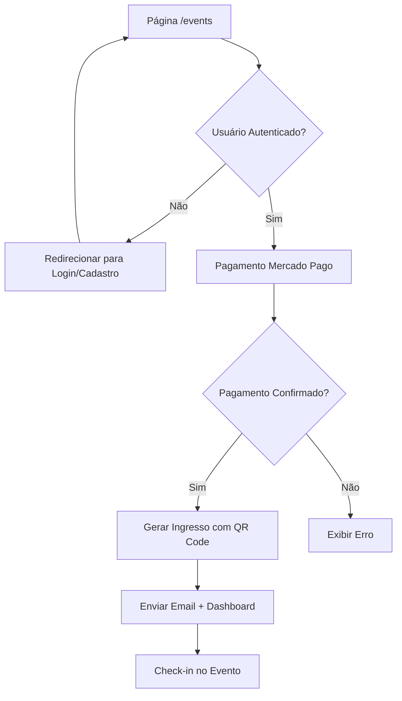

## 1. Visão Geral do Produto
Sistema de gestão de eventos com página pública de divulgação, venda de ingressos via Mercado Pago, geração automática de ingressos com QR Code e validação no check-in. O sistema reutiliza integralmente o cadastro e autenticação existentes do site.

- **Problema**: Necessidade de divulgação profissional de eventos e conversão de visitantes em participantes
- **Público-alvo**: Usuários do site que desejam participar de eventos e administradores que gerenciam eventos
- **Valor**: Integração completa com sistema existente, evitando duplicação de funcionalidades

## 2. Funcionalidades Principais

### 2.1 Papéis de Usuário
| Papel | Método de Registro | Permissões Principais |
|-------|-------------------|----------------------|
| Visitante | Não requer registro | Visualizar página de eventos |
| Usuário Cadastrado | Sistema existente de cadastro/login | Comprar ingressos, acessar ingressos no painel |
| Administrador | Sistema existente + permissões admin | Criar/editar eventos, validar ingressos, gerenciar check-in |

### 2.2 Módulos de Funcionalidades
O sistema de eventos consiste nos seguintes módulos principais:
1. **Página Pública de Eventos**: Hero section, informações do evento, programação, palestrantes, galeria e CTA
2. **Fluxo de Compra**: Verificação de autenticação, redirecionamento para login/cadastro existente, pagamento via Mercado Pago
3. **Geração de Ingressos**: Criação automática após pagamento, QR Code único, PDF com DomPDF
4. **Painel do Cliente**: Visualização de ingressos comprados, download de PDF, histórico de pagamentos
5. **Painel Administrativo**: CRUD de eventos, visualização de ingressos, check-in via QR Code

### 2.3 Detalhes das Páginas
| Nome da Página | Módulo | Descrição das Funcionalidades |
|----------------|---------|-------------------------------|
| /events | Hero Section | Apresentar nome do evento, data/horário/local, headline principal e botão "Participar" |
| /events | Sobre o Evento | Descrição detalhada do evento, objetivos e informações relevantes |
| /events | Programação | Lista de atividades com horários e descrições |
| /events | Palestrantes/Organizadores | Perfis dos responsáveis pelo evento |
| /events | Galeria | Imagens do evento ou edições anteriores |
| /events | CTA Final | Botão secundário "Participar" para reforço de conversão |
| /dashboard | Meus Ingressos | Listar eventos adquiridos com status e ações |
| /dashboard | Visualizar Ingresso | Exibir QR Code, dados do evento e opções de download |
| /admin/events | CRUD Eventos | Criar, editar, listar e excluir eventos |
| /admin/events/{id} | Ingressos por Evento | Visualizar todos os ingressos vendidos com filtros |
| /admin/check-in | Validar Ingresso | Scanner de QR Code para check-in no dia do evento |

## 3. Fluxo Principal do Usuário

### Fluxo de Participação em Evento
1. Usuário acessa página /events
2. Visualiza informações do evento
3. Clica em "Participar" (botão em hero ou CTA final)
4. Sistema verifica autenticação via Auth::user()
5. Se não autenticado: redireciona para login/cadastro existente
6. Se autenticado: prossegue para pagamento via Mercado Pago
7. Após pagamento confirmado: gera ingresso com QR Code
8. Envia ingresso por email e disponibiliza no dashboard

## 4. Design da Interface

### 4.1 Estilo de Design
- **Cores Primárias**: Tailwind slate/gray para base, com cor de destaque baseada no branding do site
- **Cores Secundárias**: Tons complementares para estados hover e elementos de destaque
- **Botões**: Estilo rounded-lg com sombra sutil, primary color para CTA principal
- **Tipografia**: Fonte padrão do site, tamanhos hierárquicos para hero (text-4xl), headings (text-2xl), body (text-base)
- **Layout**: Card-based para seções de conteúdo, navegação top fixa
- **Ícones**: Heroicons ou similar para consistência visual

### 4.2 Visão Geral das Páginas
| Nome da Página | Módulo | Elementos de UI |
|----------------|---------|-----------------|
| /events | Hero Section | Background gradient/imagem, título em destaque, data/hora em cards, botão CTA primário sticky |
| /events | Sobre | Texto em coluna centralizada, imagens de apoio, ícones para destaques |
| /events | Programação | Timeline vertical com cards para cada atividade, hora destacada |
| /events | Palestrantes | Grid responsivo de cards com foto, nome e descrição |
| /dashboard | Meus Ingressos | Tabela/lista com miniatura do evento, data, status e ações |
| /dashboard | Ingresso Detalhe | QR Code grande centralizado, dados do evento em cards, botões de download |
| /admin/check-in | Scanner | Câmera em tempo real, indicador visual de validação, histórico recente |

### 4.3 Responsividade
- **Desktop-first**: Design otimizado para desktop com adaptação mobile
- **Breakpoints**: Tailwind padrão (sm, md, lg, xl)
- **Mobile**: Menu hamburger, cards empilhados, CTA fixo na bottom bar
- **Touch**: Botões com área de toque mínima 44x44px, scroll suave

## 5. Integrações e Segurança

### 5.1 Integrações Externas
- **Mercado Pago**: SDK oficial para criação de preferências e webhooks
- **Email**: Sistema existente do Laravel para envio de ingressos
- **QR Code**: Biblioteca Simple QrCode para geração segura

### 5.2 Segurança
- Middleware auth para proteção de rotas de compra
- Policies para acesso a ingressos (usuário só vê seus próprios)
- Validação de webhooks do Mercado Pago com assinatura
- QR Code com token criptográfico único e expiração
- Check-in idempotente para evitar duplicatas