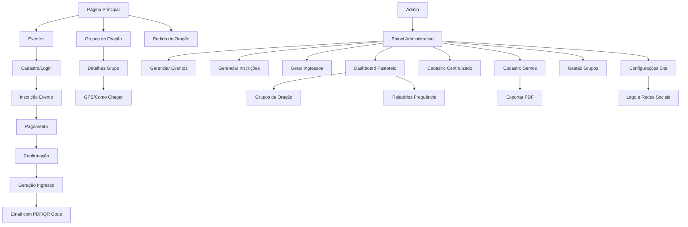

## 1. Product Overview
Site institucional para igreja cristã com sistema completo de gestão de eventos, inscrições, pagamentos e pastoreio de fiéis. Permite gerar ingressos com QR code, envio por email, dashboard administrativo completo e controle de participação em grupos de oração. O sistema unificado de cadastro centralizado reutiliza informações do fiel em todo o site, tanto para inscrições online quanto para cadastro na porta da igreja.

## 2. Core Features

### 2.1 User Roles
| Role | Registration Method | Core Permissions |
|------|---------------------|------------------|
| Membro | Cadastro único via formulário | Visualizar eventos, fazer inscrições, pedidos de oração |
| Visitante | Visualização sem cadastro | Visualizar eventos, pedidos de oração |
| Administrador | Cadastro via painel admin | Gerenciar eventos, inscrições, usuários, conteúdo do site |

### 2.2 Feature Module
Nosso site da igreja consiste nas seguintes páginas principais:
1. **Página Principal**: carrossel de fotos, próximos eventos, coordenadores de ministérios, pedidos de oração, rodapé com informações de contato
2. **Página de Eventos**: listagem de eventos, detalhes do evento, inscrição e pagamento
3. **Página de Cadastro/Login**: formulário único para todo o sistema
4. **Painel Administrativo**: gestão completa incluindo eventos, inscrições, usuários, ingressos, pastoreio e dashboard analítico
5. **Sistema de Ingressos**: geração de PDF com QR code, envio por email, validação na entrada
6. **Dashboard de Pastoreio**: controle de participação em grupos de oração, frequência e relatórios
7. **Painel de Configurações**: gestão de logo do site e redes sociais
8. **Grupos de Oração**: visualização pública com fotos, informações e navegação GPS
9. **Cadastro de Servos**: ficha completa estilo currículo com impressão e exportação PDF

### 2.3 Page Details
| Page Name | Module Name | Feature description |
|-----------|-------------|---------------------|
| Página Principal | Carrossel de Fotos | Exibir fotos dos últimos encontros em formato de slide automático com navegação manual. |
| Página Principal | Próximos Eventos | Mostrar cards dos próximos eventos com data, local e breve descrição. |
| Página Principal | Coordenadores de Ministérios | Apresentar fotos e nomes dos líderes com descrição de seus ministérios. |
| Página Principal | Pedidos de Oração | Formulário simples para envio anônimo ou identificado de pedidos de oração. |
| Página Principal | Rodapé | Exibir endereço da igreja, redes sociais, horários de culto e contato. |
| Página de Eventos | Listagem de Eventos | Mostrar todos os eventos futuros com filtros por categoria e data. |
| Página de Eventos | Detalhes do Evento | Exibir informações completas do evento: descrição, local, horário, valor. |
| Página de Eventos | Inscrição e Pagamento | Formulário de inscrição com integração de pagamento online (cartão/boleto). |
| Cadastro/Login | Formulário Único | Cadastro unificado que serve para todo o site e painel administrativo. |
| Painel Administrativo | Gestão de Eventos | Criar, editar, excluir eventos e visualizar inscrições. |
| Painel Administrativo | Gestão de Inscrições | Aprovar inscrições, confirmar pagamentos, emitir relatórios. |
| Painel Administrativo | Gestão de Usuários | Visualizar e gerenciar perfis de membros e administradores. |
| Painel Administrativo | Geração de Ingressos | Criar ingressos com QR code único, gerar PDF e enviar por email automaticamente. |
| Painel Administrativo | Dashboard de Inscrições | Visualizar inscrições por evento, status de pagamento, comparecimento e métricas. |
| Painel Administrativo | Controle de Pastoreio | Gerenciar participação em grupos de oração, frequência e ausências. |
| Painel Administrativo | Cadastro Centralizado | Formulário simplificado para cadastrar fiéis na porta da igreja, reutilizando dados existentes. |
| Painel Administrativo | Configurações do Site | Upload de logo, configuração de links de redes sociais (Facebook, Instagram, YouTube, WhatsApp). |
| Painel Administrativo | Gestão de Grupos | Criar, editar e gerenciar grupos de oração com fotos, endereços e informações completas. |
| Painel Administrativo | Cadastro de Servos | Formulário completo para cadastrar servos com foto, dados pessoais, ministérios e histórico. |
| Painel Administrativo | Funções e Ministérios | Gerenciar cargos, funções e ministérios disponíveis para alocação de servos. |
| Sistema de Ingressos | Validação de Entrada | Ler QR code na entrada do evento para validar ingresso e registrar comparecimento. |
| Dashboard de Pastoreio | Relatórios de Frequência | Gerar relatórios de quem mais participa, faltantes e tendências de participação. |
| Página Principal | Grupos de Oração | Seção destacada mostrando grupos da cidade com preview e link para detalhes. |
| Página de Grupos | Detalhes do Grupo | Fotos, informações completas, participantes, botão "Como Chegar" com GPS. |
| Cadastro de Servos | Ficha Completa | Formulário estilo currículo com todos os dados, histórico, formações e eventos. |
| Cadastro de Servos | Exportação | Botão para imprimir ou exportar ficha em PDF com layout profissional. |

## 3. Core Process
### Fluxo do Membro/Visitante
1. Usário acessa a página principal
2. Visualiza carrossel de fotos e próximos eventos
3. Clica em evento específico
4. Realiza cadastro/login único
5. Faz inscrição no evento com pagamento
6. Recebe confirmação por email

### Fluxo Administrativo
1. Admin acessa painel administrativo
2. Cria novo evento com informações e valor
3. Visualiza inscrições recebidas
4. Confirma pagamentos
5. Gera ingressos com QR code automaticamente
6. Envia ingressos por email para inscritos
7. Valida ingressos na entrada do evento
8. Acompanha participação em grupos de oração
9. Gera relatórios de frequência e pastoreio

### Fluxo de Cadastro Centralizado
1. Fiel chega na igreja ou acessa site
2. Admin/voluntário realiza cadastro com dados básicos
3. Sistema verifica se CPF/Email já existe
4. Se existir, sugere autocompletar com dados existentes
5. Se não existir, cria novo cadastro único
6. Dados ficam disponíveis para futuras inscrições online

### Fluxo de Grupos de Oração
1. Usuário acessa página principal
2. Visualiza seção de grupos de oração da cidade
3. Clica em grupo específico
4. Visualiza fotos, informações e participantes
5. Clica em "Como Chegar" para abrir GPS
6. Pode entrar em contato com o líder

### Fluxo de Cadastro de Servos
1. Admin acessa painel administrativo
2. Clica em "Cadastro de Servos"
3. Preenche formulário completo com dados pessoais
4. Seleciona ministérios e funções
5. Adiciona histórico, formações e eventos participados
6. Salva ficha do servo
7. Pode imprimir ou exportar em PDF

## 4. User Interface Design

### 4.1 Design Style
- **Cores Primárias**: Azul celeste (#87CEEB) e branco (#FFFFFF)
- **Cores Secundárias**: Dourado (#FFD700) e cinza claro (#F5F5F5)
- **Estilo de Botões**: Arredondados com gradiente suave
- **Fonte**: Open Sans para textos, Montserrat para títulos
- **Tamanhos de Fonte**: Títulos 24-32px, Textos 14-16px, Botões 16px
- **Layout**: Baseado em cards com sombras suaves
- **Ícones**: Estilo line-art cristão (cruz, pomba, livro)

### 4.2 Page Design Overview
| Page Name | Module Name | UI Elements |
|-----------|-------------|-------------|
| Página Principal | Carrossel | Full-width, altura 400px, transição automática a cada 5s, indicadores de progresso. |
| Página Principal | Próximos Eventos | Grid responsivo de cards com imagem, título, data e botão "Inscrever-se". |
| Página Principal | Coordenadores | Grid de fotos circulares com nome e cargo, hover mostra descrição do ministério. |
| Página Principal | Pedidos Oração | Formulário compacto com campo de texto e botão de envio, opção anônimo. |
| Página Principal | Rodapé | 4 colunas: endereço, horários, redes sociais (ícones), formulário contato. |
| Página de Eventos | Listagem | Cards horizontais com imagem lateral, filtros laterais por categoria. |
| Página de Eventos | Inscrição | Formulário em steps: dados pessoais → pagamento → confirmação. |

### 4.3 Responsiveness
- **Desktop-first**: Design otimizado para telas grandes (1920px)
- **Mobile-adaptive**: Layout adaptativo para tablets (768px) e smartphones (375px)
- **Touch optimization**: Botões com área mínima de 44x44px, gestos de swipe no carrossel