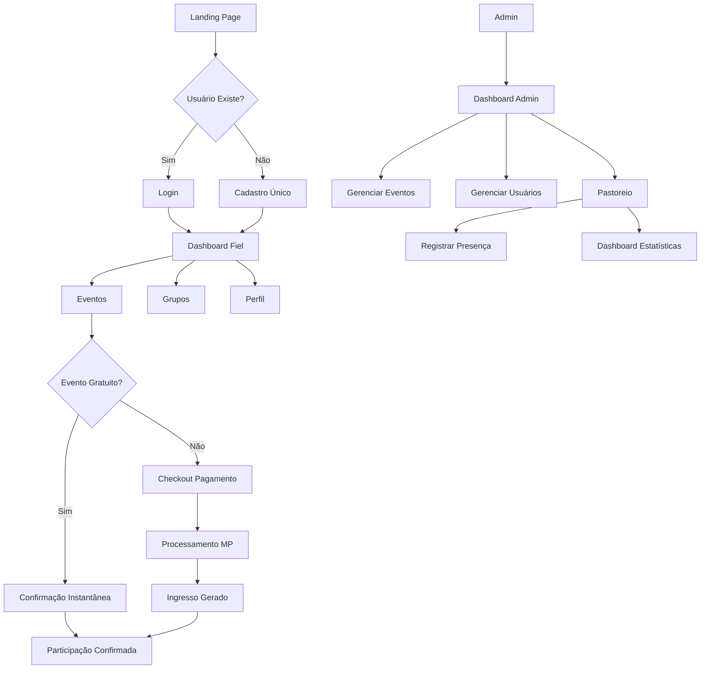

## 1. Product Overview
Sistema completo para gestão de grupos de oração RCC com interface moderna, dashboard administrativo robusto e experiência de usuário otimizada. O sistema permite cadastro único de fiéis, gestão de eventos, pagamentos integrados, pastoreio automatizado e comunicação via WhatsApp.

**Problema resolvido:** Centralizar toda gestão pastoral e administrativa da RCC em uma plataforma única, eliminando processos manuais e melhorando engajamento dos fiéis.

**Valor de mercado:** Solução completa para instituições religiosas modernizarem sua gestão com tecnologia de ponta.

## 2. Core Features

### 2.1 User Roles
| Role | Registration Method | Core Permissions |
|------|---------------------|------------------|
| Fiel | Self-registration via form | View events, register for events, view personal dashboard, download tickets |
| Servo | Admin assignment | All fiel permissions + manage group attendance, view group reports |
| Admin | Pre-configured access | Full system management, CRUD all entities, view all reports, configure system settings |

### 2.2 Feature Module
Nosso sistema RCC consiste nas seguintes páginas principais:

1. **Landing Page**: Hero section com carrossel, próximos eventos, grupos de oração, call-to-actions evangelísticos
2. **Página de Eventos**: Listagem filtrável, detalhes completos, inscrição integrada
3. **Página de Grupos**: Visualização todos grupos, fotos, horários, localização
4. **Dashboard do Fiel**: Meus eventos, ingressos, histórico de presença, perfil completo
5. **Dashboard Admin**: Analytics completos, gestão usuários/eventos/grupos, relatórios, configurações
6. **Sistema de Pastoreio**: Busca rápida, registro presença, dashboards estatísticos, sorteios
7. **Área de Pagamento**: Checkout moderno, múltiplos métodos, confirmação instantânea
8. **Gerenciamento de Ingressos**: Visualização, download PDF, QR code único

### 2.3 Page Details
| Page Name | Module Name | Feature description |
|-----------|-------------|---------------------|
| Landing Page | Hero Section | Carrossel automático de imagens com transições suaves, call-to-action principal para novos visitantes |
| Landing Page | Próximos Eventos | Cards modernos com imagens, data, local e botão de inscrição destacado |
| Landing Page | Grupos de Oração | Grid responsivo com fotos, horários e botões "Quero participar" |
| Landing Page | Testemunhos | Carrossel de depoimentos reais com fotos e nomes |
| Eventos | Listagem | Filtros por data, tipo, localização, pagamento; cards interativos com hover effects |
| Eventos | Detalhes | Galeria de fotos, descrição rica, mapa de localização, form de inscrição inline |
| Grupos | Visualização | Mapa interativo, cards com informações completas, galeria de fotos por grupo |
| Dashboard Fiel | Meus Eventos | Timeline visual de participações, status de pagamento, acesso rápido a ingressos |
| Dashboard Fiel | Perfil | Form editável, histórico completo, estatísticas de presença em grupo |
| Dashboard Admin | Analytics | Gráficos em tempo real, KPIs principais, tendências de crescimento |
| Dashboard Admin | Gestão de Usuários | Tabela avançada com filtros, bulk actions, merge de duplicados |
| Dashboard Admin | Gestão de Eventos | Editor visual completo, preview em tempo real, configuração de pagamento |
| Pastoreio | Busca Rápida | Autocomplete inteligente, resultados em tempo real, múltiplos critérios |
| Pastoreio | Registro de Presença | Interface touch-friendly, confirmação visual imediata, histórico do dia |
| Pastoreio | Dashboard Estatísticas | Visualizações múltiplas: heatmap, gráficos, rankings, exportações |
| Checkout | Métodos de Pagamento | PIX, cartão, boleto; interface clean com validação em tempo real |
| Checkout | Confirmação | Página de sucesso animada, email/WhatsApp automático, instruções claras |
| Ingressos | Visualização | Design moderno, QR code destacado, informações completas do evento |
| Ingressos | Download | PDF de alta qualidade, pronto para impressão, validação anti-fraude |

## 3. Core Process

### Fluxo do Visitante → Fiel
1. Visitante acessa Landing Page → Visualiza eventos e grupos
2. Clica em "Participar" → Fluxo de cadastro único (busca por duplicados)
3. Completou cadastro → Dashboard pessoal com eventos e ingressos
4. Participa de grupo → Presença registrada automaticamente
5. Recebe comunicações → WhatsApp automatizado para lembretes

### Fluxo do Administrador
1. Login no Dashboard Admin → Visão geral do sistema
2. Cria evento → Editor visual com preview
3. Configura pagamento → Integração Mercado Pago ativada
4. Monitora inscrições → Analytics em tempo real
5. Gerencia pastoreio → Busca rápida e registros eficientes

### Fluxo de Pagamento
1. Usuário seleciona evento pago → Checkout moderno
2. Escolhe método de pagamento → Interface adaptativa
3. Processamento Mercado Pago → Webhook confirma status
4. Aprovação automática → Ingresso gerado e enviado
5. Atualização em tempo real → Dashboards atualizados

## 4. User Interface Design

### 4.1 Design Style
- **Cores Primárias**: Verde RCC (#2E8B57), Dourado (#FFD700), Branco (#FFFFFF)
- **Cores Secundárias**: Verde escuro (#1F5F1F), Cinza claro (#F5F5F5), Preto texto (#2C3E50)
- **Botões**: Estilo moderno com border-radius 8px, hover effects suaves, sombras sutis
- **Tipografia**: Fonte principal - Inter (clean e moderna), títulos em bold, corpo regular
- **Layout**: Card-based design com espaçamento generoso, grid system de 12 colunas
- **Ícones**: Material Design Icons, consistentes e modernos
- **Animações**: Transições suaves (0.3s), parallax no hero, micro-interações nos cards

### 4.2 Page Design Overview
| Page Name | Module Name | UI Elements |
|-----------|-------------|-------------|
| Landing Page | Hero Section | Carrossel full-width com overlay escuro, texto em branco, CTA verde vibrante, navegação por dots modernos |
| Landing Page | Event Cards | Cards com imagem 16:9, badge de data verde, título em negrito, descrição truncada, botão dourado destacado |
| Dashboard Admin | Analytics Cards | Cards com bordas arredondadas, ícones coloridos, números grandes, gráficos miniatura, cores baseadas em status |
| Pastoreio | Search Interface | Barra de pesquisa expansiva, resultados em dropdown, cards de usuário com foto, badges de status coloridos |
| Checkout | Payment Methods | Tabs horizontais com ícones, forms com labels flutuantes, validação visual em tempo real, botão grande e destacado |
| Mobile Views | Responsive Cards | Cards empilhados verticalmente, botões full-width no mobile, menus hamburger com animações suaves |

### 4.3 Responsiveness
- **Desktop-first**: Design otimizado para telas grandes (1920px), máximo aproveitamento do espaço
- **Mobile-adaptive**: Breakpoints em 768px e 480px, reorganização inteligente de elementos
- **Touch optimization**: Botões mínimos 44px, espaçamento generoso entre elementos clicáveis
- **Performance**: Imagens responsivas com lazy loading, assets otimizados para cada breakpoint

### 4.4 3D Scene Guidance (Landing Page Hero)
- **Ambiente**: Studio com iluminação suave, fundo gradiente de verde para dourado
- **Elementos 3D**: Cruz flutuante com material metálico dourado, partículas de luz subindo
- **Câmera**: Movimento suave de orbita ao redor da cruz, FOV 60°, posição inicial ligeiramente abaixo
- **Animações**: Cruz gira lentamente (2rpm), partículas sobem com variação de velocidade
- **Interação**: Hover do mouse influencia velocidade de rotação, clique ativa animação especial
- **Post-processing**: Bloom suave nos elementos dourados, depth of field leve