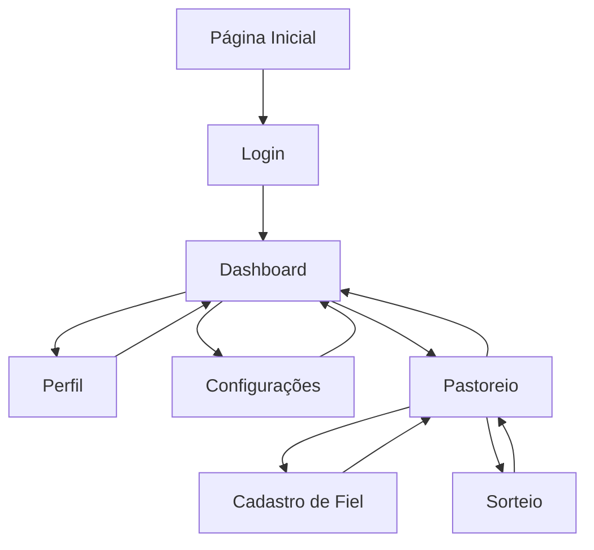

## 1. Product Overview
Aplicação web com design system baseado na paleta RCC (Red, Cyan, Cinza) priorizando experiência desktop-first com navegação intuitiva e componentes acessíveis. O produto visa fornecer interface moderna e responsiva com foco em usabilidade e consistência visual.

## 2. Core Features

### 2.1 User Roles
| Role | Registration Method | Core Permissions |
|------|---------------------|------------------|
| Usuário Comum | Email registration | Acesso a todas as funcionalidades básicas da aplicação |
| Administrador | Convite via email | Gerenciamento de conteúdo e configurações do sistema |

### 2.2 Feature Module
A aplicação consiste nos seguintes componentes principais:
1. **Página Inicial**: hero section com call-to-action, navegação principal, cards de destaque
2. **Página de Dashboard**: interface principal com widgets, gráficos e estatísticas
3. **Página de Perfil**: formulário de edição, visualização de dados pessoais
4. **Página de Configurações**: preferências do usuário, temas, notificações
5. **Página de Pastoreio**: cadastro de fiéis, controle de presenças, sorteios
6. **Página de Cadastro de Fiel**: formulário para novos participantes
7. **Página de Sorteio**: interface para realizar sorteios entre presentes do dia

### 2.3 Page Details
| Page Name | Module Name | Feature description |
|-----------|-------------|---------------------|
| Página Inicial | Hero Section | Apresentação visual com animação suave, botão de call-to-action destacado |
| Página Inicial | Navegação Principal | Menu horizontal com hover effects, logo posicionada à esquerda, links alinhados à direita |
| Página Inicial | Cards de Destaque | Grid responsivo com cards interativos, ícones da paleta RCC, transições suaves |
| Dashboard | Widgets | Componentes modulares com bordas arredondadas, sombras sutis, cores da paleta RCC |
| Dashboard | Gráficos | Visualizações interativas com tooltips, legendas acessíveis, esquema de cores consistente |
| Perfil | Formulário de Edição | Campos com validação em tempo real, botões com estados de loading, feedback visual |
| Perfil | Visualização de Dados | Cards informativos com ícones, layout em duas colunas para desktop |
| Configurações | Preferências | Toggle switches customizados, dropdowns com estilo RCC, save automático |
| Configurações | Temas | Switcher de temas com preview, persistência de preferências |

## 3. Core Process
### Fluxo do Usuário Comum
1. Acessa a página inicial e visualiza o hero section
2. Navega pelos cards de destaque para entender as funcionalidades
3. Realiza login através do formulário de autenticação
4. Acessa o dashboard principal com widgets e informações
5. Gerencia seu perfil e preferências através das páginas dedicadas

### Fluxo do Administrador
1. Login com credenciais de administrador
2. Acesso ao painel administrativo com funcionalidades adicionais
3. Gerenciamento de usuários e conteúdo do sistema

### Fluxo de Pastoreio
1. Acessa página de pastoreio e busca fiel por nome ou CPF
2. Se novo fiel: preenche formulário de cadastro com dados básicos
3. Se fiel existente: confirma presença com um clique
4. Sistema contabiliza presenças automaticamente (máximo 80 por dia)
5. Quando atingir 80 presentes: botão de sorteio é habilitado
6. Realiza sorteio entre os presentes do dia específico
7. Ganhador confirma presença através de botão na interface
8. Sistema registra sorteio no histórico com data, grupo e ganhador
9. Dashboard atualiza com métricas: participação, ausências, novos fiéis
10. Envio automatizado de mensagens para fiéis ausentes via email/SMS/WhatsApp

## 4. User Interface Design

### 4.1 Design Style
**Paleta de Cores RCC:**
- Primária: Vermelho (#DC2626) - para elementos de ação e destaque
- Secundária: Ciano (#0891B2) - para links e estados hover
- Neutros: Tons de cinza (#6B7280, #9CA3AF, #F3F4F6) - para backgrounds e textos

**Elementos de Design:**
- Botões: Estilo rounded com padding generoso, hover effects suaves
- Tipografia: Fonte sans-serif moderna (Inter ou similar), hierarquia clara de tamanhos
- Layout: Card-based com espaçamento consistente (8px grid system)
- Ícones: Estilo outline minimalista, espessura consistente de 2px
- Animações: Transições de 200-300ms, easing curves naturais

### 4.2 Page Design Overview
| Page Name | Module Name | UI Elements |
|-----------|-------------|-------------|
| Página Inicial | Hero Section | Background gradient suave vermelho->rosa, texto branco com sombra, CTA button vermelho vibrante com hover ciano |
| Página Inicial | Navegação | Header fixo semi-transparente, logo RCC estilizada, menu items com underline animado no hover |
| Página Inicial | Cards | Grid 3x1 desktop, 1x3 mobile, bordas arredondadas 12px, sombra box-shadow suave, ícones ciano |
| Dashboard | Widgets | Container branco com border 1px cinza claro, header com background cinza muito claro, padding 24px |
| Dashboard | Gráficos | Paleta RCC aplicada em gradients, tooltips com background escuro e texto claro, animação de entrada |
| Perfil | Formulário | Labels cinza escuro, inputs com border 2px cinza claro focando para ciano, botões vermelho com hover states |
| Configurações | Toggle Switches | Design customizado com thumb ciano e track cinha claro, animação suave de slide |
| Pastoreio | Cadastro de Fiel | Formulário com nome, CPF, telefone, email, endereço, data de nascimento, botão de salvar com validação |
| Pastoreio | Busca de Fiel | Campo de busca por nome ou CPF com autocomplete, botão de confirmar presença |
| Pastoreio | Controle de Presenças | Lista de presentes do dia com contador automático, indicação de novos vs participantes antigos |
| Pastoreio | Sorteio | Botão para iniciar sorteio quando atingir 80 pessoas, interface com animação de sorteio, botão de confirmação do ganhador |
| Dashboard | Métricas de Pastoreio | Cards com total de participantes, novos fiéis, ausências, gráfico de frequência mensal |
| Dashboard | Histórico de Sorteios | Tabela com data, ganhador, grupo, botão de detalhes, filtros por período |
| Dashboard | Comunicação | Botões para enviar mensagens via email/SMS/WhatsApp para fiéis ausentes, template de mensagens personalizáveis |

### 4.3 Responsiveness
- **Desktop-first**: Design otimizado para telas 1440px e acima
- **Breakpoints**: 1440px (desktop), 1024px (tablet), 768px (mobile)
- **Mobile-adaptive**: Layouts adaptam-se com hambúrguer menu, cards empilhados, formulários single-column
- **Touch optimization**: Áreas de toque mínimas de 44x44px, gestos de swipe em carrosséis
- **Acessibilidade**: Suporte para navegação por teclado, contraste WCAG 2.1 AA, screen reader friendly