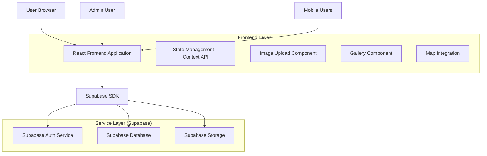
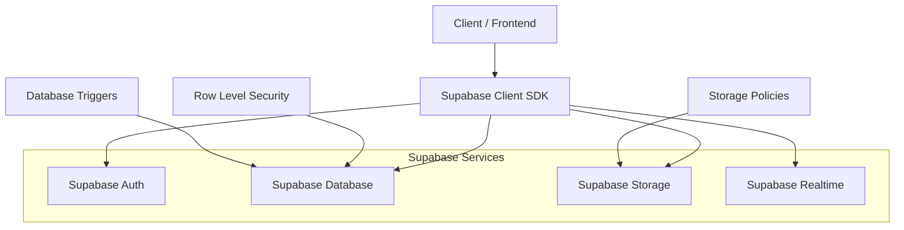
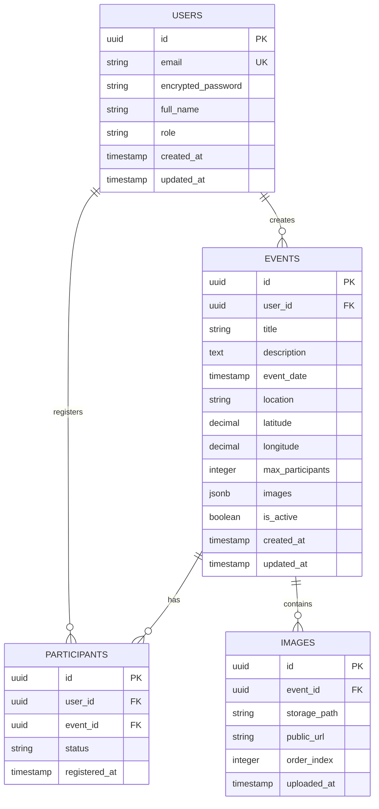

## 1. Architecture design



## 2. Technology Description

- **Frontend**: React@18 + tailwindcss@3 + vite
- **Initialization Tool**: vite-init
- **Backend**: Supabase (BaaS)
- **Map Integration**: Leaflet ou Mapbox GL JS
- **Image Processing**: Browser Image Compression
- **Testing**: Jest + React Testing Library + Cypress (E2E)

## 3. Route definitions

| Route | Purpose |
|-------|---------|
| / | Home page com sistema de estado de login dinâmico |
| /login | Página de autenticação de usuários |
| /register | Página de cadastro de novos usuários |
| /events | Listagem de eventos públicos |
| /events/:id | Detalhes do evento com galeria, mapa e ações |
| /admin/events | Dashboard administrativo de eventos |
| /admin/events/new | Criar novo evento |
| /admin/events/:id/edit | Editar evento existente com upload de imagens |
| /profile | Perfil do usuário logado |

## 4. API definitions

### 4.1 Authentication APIs

```
POST /auth/v1/token
```

Request:
| Param Name | Param Type | isRequired | Description |
|------------|-------------|-------------|-------------|
| email | string | true | Email do usuário |
| password | string | true | Senha (mínimo 6 caracteres) |

Response:
| Param Name | Param Type | Description |
|------------|-------------|-------------|
| access_token | string | JWT token para autenticação |
| user | object | Dados do usuário autenticado |
| session | object | Sessão ativa com tempo de expiração |

### 4.2 Event Management APIs

```
GET /rest/v1/events
```

Query Parameters:
| Param Name | Param Type | isRequired | Description |
|------------|-------------|-------------|-------------|
| select | string | false | Colunas a retornar (* para todas) |
| order | string | false | Ordenação (created_at.desc) |
| limit | number | false | Limite de resultados (default: 20) |

```
POST /rest/v1/events
```

Request Body:
| Param Name | Param Type | isRequired | Description |
|------------|-------------|-------------|-------------|
| title | string | true | Título do evento |
| description | string | true | Descrição completa |
| date | timestamp | true | Data e hora do evento |
| location | string | true | Localização/endereço |
| latitude | number | false | Coordenada latitude para mapa |
| longitude | number | false | Coordenada longitude para mapa |
| max_participants | number | false | Capacidade máxima |
| images | jsonb | false | Array de URLs das imagens |

### 4.3 Image Upload APIs

```
POST /storage/v1/object/events/:eventId/
```

Form Data:
| Param Name | Param Type | isRequired | Description |
|------------|-------------|-------------|-------------|
| file | File | true | Arquivo de imagem (JPEG/PNG, max 5MB) |

Response:
| Param Name | Param Type | Description |
|------------|-------------|-------------|
| Key | string | Caminho do arquivo no storage |
| publicUrl | string | URL pública para acesso à imagem |

## 5. Server architecture diagram



## 6. Data model

### 6.1 Data model definition



### 6.2 Data Definition Language

**Users Table**
```sql
-- create table
CREATE TABLE users (
    id UUID PRIMARY KEY DEFAULT gen_random_uuid(),
    email VARCHAR(255) UNIQUE NOT NULL,
    encrypted_password VARCHAR(255) NOT NULL,
    full_name VARCHAR(255) NOT NULL,
    role VARCHAR(50) DEFAULT 'user' CHECK (role IN ('user', 'admin')),
    created_at TIMESTAMP WITH TIME ZONE DEFAULT NOW(),
    updated_at TIMESTAMP WITH TIME ZONE DEFAULT NOW()
);

-- create index
CREATE INDEX idx_users_email ON users(email);
CREATE INDEX idx_users_role ON users(role);
```

**Events Table**
```sql
-- create table
CREATE TABLE events (
    id UUID PRIMARY KEY DEFAULT gen_random_uuid(),
    user_id UUID REFERENCES auth.users(id) ON DELETE CASCADE,
    title VARCHAR(255) NOT NULL,
    description TEXT NOT NULL,
    event_date TIMESTAMP WITH TIME ZONE NOT NULL,
    location VARCHAR(500) NOT NULL,
    latitude DECIMAL(10, 8),
    longitude DECIMAL(11, 8),
    max_participants INTEGER DEFAULT 100,
    images JSONB DEFAULT '[]',
    is_active BOOLEAN DEFAULT true,
    created_at TIMESTAMP WITH TIME ZONE DEFAULT NOW(),
    updated_at TIMESTAMP WITH TIME ZONE DEFAULT NOW()
);

-- create index
CREATE INDEX idx_events_user_id ON events(user_id);
CREATE INDEX idx_events_event_date ON events(event_date);
CREATE INDEX idx_events_is_active ON events(is_active);
```

**Participants Table**
```sql
-- create table
CREATE TABLE participants (
    id UUID PRIMARY KEY DEFAULT gen_random_uuid(),
    user_id UUID REFERENCES auth.users(id) ON DELETE CASCADE,
    event_id UUID REFERENCES events(id) ON DELETE CASCADE,
    status VARCHAR(50) DEFAULT 'confirmed' CHECK (status IN ('confirmed', 'interested', 'cancelled')),
    registered_at TIMESTAMP WITH TIME ZONE DEFAULT NOW(),
    UNIQUE(user_id, event_id)
);

-- create index
CREATE INDEX idx_participants_user_id ON participants(user_id);
CREATE INDEX idx_participants_event_id ON participants(event_id);
CREATE INDEX idx_participants_status ON participants(status);
```

**Row Level Security Policies**
```sql
-- Enable RLS
ALTER TABLE events ENABLE ROW LEVEL SECURITY;
ALTER TABLE participants ENABLE ROW LEVEL SECURITY;

-- Grant permissions
GRANT SELECT ON events TO anon;
GRANT ALL ON events TO authenticated;
GRANT SELECT ON participants TO anon;
GRANT ALL ON participants TO authenticated;

-- Create policies
CREATE POLICY "Events are viewable by everyone" ON events FOR SELECT USING (is_active = true);
CREATE POLICY "Users can insert their own events" ON events FOR INSERT WITH CHECK (auth.uid() = user_id);
CREATE POLICY "Users can update their own events" ON events FOR UPDATE USING (auth.uid() = user_id);
CREATE POLICY "Users can delete their own events" ON events FOR DELETE USING (auth.uid() = user_id);

CREATE POLICY "Participants are viewable by everyone" ON participants FOR SELECT USING (true);
CREATE POLICY "Users can manage their participations" ON participants FOR ALL USING (auth.uid() = user_id);
```

**Storage Policies**
```sql
-- Create storage bucket
INSERT INTO storage.buckets (id, name, public) VALUES ('event-images', 'event-images', true);

-- Grant access
GRANT ALL ON storage.objects TO authenticated;

-- Create storage policies
CREATE POLICY "Event images are publicly accessible" ON storage.objects FOR SELECT USING (bucket_id = 'event-images');
CREATE POLICY "Authenticated users can upload event images" ON storage.objects FOR INSERT WITH CHECK (
    bucket_id = 'event-images' AND 
    auth.role() = 'authenticated' AND
    (storage.filename(name) ~ '\.(jpg|jpeg|png)$') AND
    (storage.filesize(name) < 5242880)
);
```