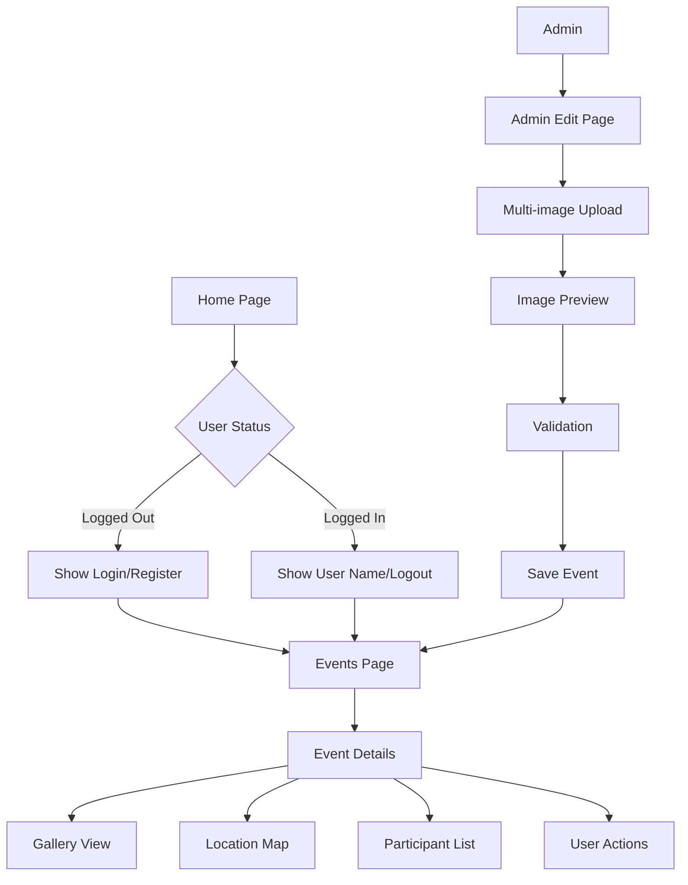

## 1. Product Overview
Redesign completo da interface do sistema de eventos para melhorar a experiência do usuário através de interface responsiva, estados de login dinâmicos e funcionalidades aprimoradas de gerenciamento de eventos.

O produto visa resolver problemas de usabilidade existentes, proporcionando interface intuitiva para usuários finais e ferramentas poderosas para administradores gerenciarem eventos com múltiplas imagens e informações detalhadas.

## 2. Core Features

### 2.1 User Roles
| Role | Registration Method | Core Permissions |
|------|---------------------|------------------|
| Visitante | Não requerido | Visualizar eventos públicos, navegação básica |
| Usuário Logado | Email/Senha | Participar de eventos, favoritar, compartilhar, ver lista de participantes |
| Administrador | Acesso especial | Criar, editar, excluir eventos, upload de múltiplas imagens, gerenciar participantes |

### 2.2 Feature Module
O sistema de eventos consiste nos seguintes módulos principais:

1. **Página Principal**: Hero section, navegação, sistema de estado de login dinâmico, indicadores visuais
2. **Página de Eventos**: Galeria de fotos, detalhes completos, mapa de localização, lista de participantes, ações do usuário
3. **Administração de Eventos**: Formulário de edição com upload múltiplo de imagens, pré-visualização, validação de arquivos
4. **Sistema de Autenticação**: Login, cadastro, logout com feedback visual

### 2.3 Page Details
| Page Name | Module Name | Feature description |
|-----------|-------------|---------------------|
| Home page | Sistema de Estado de Login | Detectar estado do usuário e mostrar/ocultar botões apropriados (Cadastro/Login quando deslogado, Nome do usuário/Logout quando logado) |
| Home page | Indicador Visual de Login | Exibir ícone ou texto claro indicando se usuário está logado ou não |
| Home page | Navegação Principal | Menu com links para páginas principais, responsivo para mobile |
| Events page | Galeria de Fotos | Carrossel ou grid com mínimo 3 imagens por evento, navegação intuitiva entre imagens |
| Events page | Detalhes do Evento | Exibir descrição completa, data, horário, localização de forma clara e organizada |
| Events page | Mapa de Localização | Integrar mapa interativo mostrando local exato do evento |
| Events page | Lista de Participantes | Mostrar usuários confirmados ou interessados no evento |
| Events page | Ações do Usuário | Botões para participar, compartilhar nas redes sociais, adicionar aos favoritos |
| Admin Edit page | Upload Múltiplo de Imagens | Permitir selecionar e fazer upload de várias imagens simultaneamente |
| Admin Edit page | Pré-visualização de Imagens | Mostrar thumbnails das imagens carregadas antes de salvar |
| Admin Edit page | Validação de Imagens | Verificar formato (JPEG, PNG) e tamanho máximo dos arquivos |
| Admin Edit page | Campos Adicionais | Formulário completo com todos os detalhes do evento (descrição, data, horário, local, capacidade, etc.) |
| Feedback System | Mensagens de Ação | Exibir notificações de sucesso/erro para todas as ações do usuário |

## 3. Core Process

### Fluxo do Usuário Visitante
1. Acessa página principal → Visualiza eventos públicos → Tenta participar → Sistema solicita login → Redirecionado para login → Realiza autenticação → Retorna para evento → Pode participar

### Fluxo do Usuário Logado
1. Acessa página principal → Sistema reconhece login → Exibe nome e opção de logout → Navega para eventos → Visualiza galeria e detalhes → Participa/compartilha/favorita → Recebe confirmação visual

### Fluxo do Administrador
1. Acessa página principal → Login com credenciais admin → Navega para admin/events → Seleciona evento para editar → Upload de múltiplas imagens → Pré-visualiza imagens → Adiciona/edita informações → Salva alterações → Sistema valida e confirma

## 4. User Interface Design

### 4.1 Design Style
- **Cores Primárias**: Azul moderno (#2563EB) para elementos principais, branco (#FFFFFF) para fundo
- **Cores Secundárias**: Cinza claro (#F3F4F6) para cards, verde (#10B981) para sucesso, vermelho (#EF4444) para erros
- **Botões**: Estilo arredondado com sombra sutil, hover effects suaves
- **Fontes**: Inter ou Roboto para texto, tamanhos responsivos (14px mobile, 16px desktop)
- **Layout**: Card-based design com espaçamento generoso, navegação sticky no topo
- **Ícones**: Feather Icons ou Heroicons para consistência visual

### 4.2 Page Design Overview
| Page Name | Module Name | UI Elements |
|-----------|-------------|-------------|
| Home page | Login Status Indicator | Badge colorido próximo ao avatar do usuário, texto "Online" verde quando logado |
| Home page | Navigation Bar | Logo à esquerda, menu centralizado, área de usuário à direita, hambúrguer menu em mobile |
| Events page | Image Gallery | Carrossel com indicadores de posição, setas de navegação, zoom em hover, fullscreen option |
| Events page | Event Details | Card expansível com ícones para cada informação (calendário, relógio, localização) |
| Events page | Location Map | Mapa em card com pin colorido, botão "Ver rotas", zoom controls |
| Events page | Participant List | Avatar circular em grid, nomes em hover, contador total destacado |
| Events page | Action Buttons | Botões primários com ícones, estados de loading, feedback visual imediato |
| Admin Edit page | Image Upload | Área de drag-and-drop, progress bars individuais, preview em grid responsivo |
| Admin Edit page | Form Fields | Labels inline, validação em tempo real, help text, campos obrigatórios marcados |

### 4.3 Responsiveness
- **Desktop-first**: Design otimizado para telas grandes (1200px+), adaptado para tablets e mobile
- **Breakpoints**: 320px (mobile), 768px (tablet), 1024px (desktop), 1440px (wide)
- **Touch optimization**: Botões mínimo 44px, gestos de swipe na galeria, touch feedback
- **Performance**: Imagens otimizadas com lazy loading, código split por rotas

### 4.4 Feedback e Interações
- **Loading States**: Skeleton screens para conteúdo carregando, spinners para ações
- **Validação**: Mensagens inline para campos inválidos, cores de borda dinâmicas
- **Confirmações**: Toasts para ações bem-sucedidas, modais para ações críticas
- **Animações**: Transições suaves de 200-300ms, micro-interações nos botões