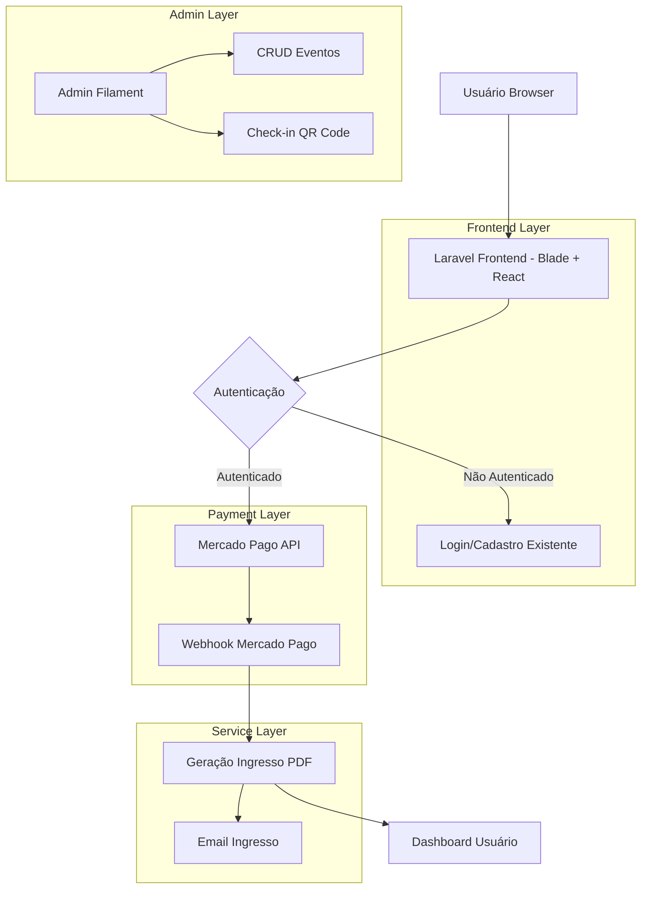
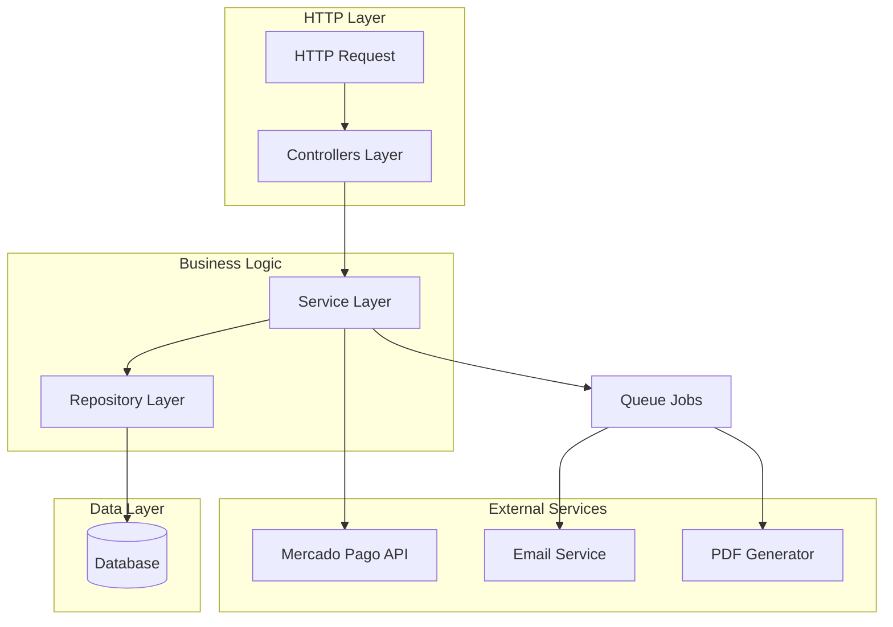
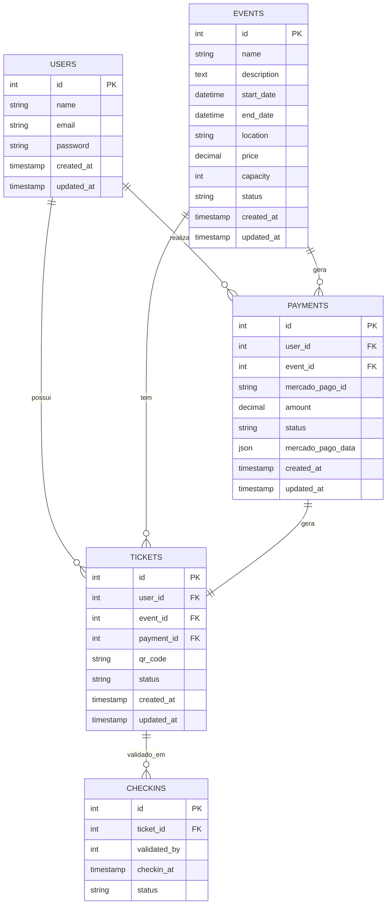

## 1. Arquitetura do Sistema



## 2. Stack Tecnológica

- **Backend**: PHP 8.2 + Laravel 12 + Filament 3 + Livewire
- **Frontend**: Blade Templates + Tailwind CSS 4 + Vite 7 + React 18 (componentes pontuais)
- **Database**: MySQL/PostgreSQL (existente)
- **Fila**: Laravel Queue (queue:listen)
- **Integrações**: Mercado Pago SDK, DomPDF, Simple QrCode, Laravel Socialite

## 3. Definições de Rotas

| Rota | Propósito |
|------|-----------|
| GET /events | Página pública do evento |
| POST /events/{id}/purchase | Iniciar compra de ingresso |
| GET /dashboard | Painel do usuário (existente) |
| GET /dashboard/tickets | Listar ingressos do usuário |
| GET /dashboard/tickets/{id} | Visualizar ingresso específico |
| GET /dashboard/tickets/{id}/download | Download PDF do ingresso |
| GET /admin/events | CRUD de eventos (Filament) |
| GET /admin/check-in | Scanner QR Code para check-in |
| POST /webhooks/mercado-pago | Receber confirmações de pagamento |

## 4. Definições de API

### 4.1 API de Pagamento

**Criar Preferência de Pagamento**
```
POST /api/payments/create-preference
```

Request:
| Parâmetro | Tipo | Obrigatório | Descrição |
|-----------|------|-------------|-----------|
| event_id | integer | true | ID do evento |
| user_id | integer | true | ID do usuário autenticado |
| price | decimal | true | Valor do ingresso |

Response:
```json
{
  "preference_id": "MP123456789",
  "init_point": "https://www.mercadopago.com.br/checkout/v1/redirect?pref_id=123",
  "status": "pending"
}
```

### 4.2 Webhook de Confirmação

**Receber Pagamento**
```
POST /webhooks/mercado-pago
```

Headers:
- `x-signature`: Assinatura do webhook para validação
- `x-request-id`: ID único da requisição

Body:
```json
{
  "action": "payment.updated",
  "api_version": "v1",
  "data": {
    "id": "123456789"
  },
  "date_created": "2025-12-19T10:00:00Z",
  "id": 123456789,
  "live_mode": true,
  "type": "payment",
  "user_id": "123456"
}
```

## 5. Arquitetura do Servidor



## 6. Modelos de Dados

### 6.1 Diagrama ER



### 6.2 Definições DDL

**Tabela Events**
```sql
CREATE TABLE events (
    id INT AUTO_INCREMENT PRIMARY KEY,
    name VARCHAR(255) NOT NULL,
    description TEXT,
    start_date DATETIME NOT NULL,
    end_date DATETIME NOT NULL,
    location VARCHAR(255) NOT NULL,
    price DECIMAL(10,2) NOT NULL,
    capacity INT NOT NULL,
    status ENUM('active', 'inactive', 'cancelled') DEFAULT 'active',
    created_at TIMESTAMP DEFAULT CURRENT_TIMESTAMP,
    updated_at TIMESTAMP DEFAULT CURRENT_TIMESTAMP ON UPDATE CURRENT_TIMESTAMP,
    INDEX idx_status (status),
    INDEX idx_dates (start_date, end_date)
);
```

**Tabela Tickets**
```sql
CREATE TABLE tickets (
    id INT AUTO_INCREMENT PRIMARY KEY,
    user_id INT NOT NULL,
    event_id INT NOT NULL,
    payment_id INT NOT NULL,
    qr_code VARCHAR(255) UNIQUE NOT NULL,
    status ENUM('active', 'used', 'cancelled') DEFAULT 'active',
    created_at TIMESTAMP DEFAULT CURRENT_TIMESTAMP,
    updated_at TIMESTAMP DEFAULT CURRENT_TIMESTAMP ON UPDATE CURRENT_TIMESTAMP,
    FOREIGN KEY (user_id) REFERENCES users(id),
    FOREIGN KEY (event_id) REFERENCES events(id),
    FOREIGN KEY (payment_id) REFERENCES payments(id),
    INDEX idx_user_event (user_id, event_id),
    INDEX idx_qr_code (qr_code)
);
```

**Tabela Payments**
```sql
CREATE TABLE payments (
    id INT AUTO_INCREMENT PRIMARY KEY,
    user_id INT NOT NULL,
    event_id INT NOT NULL,
    mercado_pago_id VARCHAR(255) UNIQUE,
    amount DECIMAL(10,2) NOT NULL,
    status ENUM('pending', 'approved', 'rejected', 'cancelled') DEFAULT 'pending',
    mercado_pago_data JSON,
    created_at TIMESTAMP DEFAULT CURRENT_TIMESTAMP,
    updated_at TIMESTAMP DEFAULT CURRENT_TIMESTAMP ON UPDATE CURRENT_TIMESTAMP,
    FOREIGN KEY (user_id) REFERENCES users(id),
    FOREIGN KEY (event_id) REFERENCES events(id),
    INDEX idx_user_payment (user_id),
    INDEX idx_mercado_pago (mercado_pago_id)
);
```

**Tabela Checkins**
```sql
CREATE TABLE checkins (
    id INT AUTO_INCREMENT PRIMARY KEY,
    ticket_id INT NOT NULL,
    validated_by INT NOT NULL,
    checkin_at TIMESTAMP DEFAULT CURRENT_TIMESTAMP,
    status ENUM('valid', 'invalid', 'duplicate') DEFAULT 'valid',
    FOREIGN KEY (ticket_id) REFERENCES tickets(id),
    FOREIGN KEY (validated_by) REFERENCES users(id),
    UNIQUE KEY unique_ticket_checkin (ticket_id),
    INDEX idx_checkin_time (checkin_at)
);
```

## 7. Configurações de Segurança

### 7.1 Middleware
- `auth`: Protege rotas de compra e dashboard
- `admin`: Restringe acesso ao painel administrativo
- `throttle`: Limita requisições de compra (10 por minuto)

### 7.2 Policies
- **TicketPolicy**: Usuário só pode visualizar seus próprios ingressos
- **EventPolicy**: Administradores podem gerenciar eventos
- **CheckinPolicy**: Validadores autorizados podem realizar check-in

### 7.3 Validações
- Webhook Mercado Pago validado por assinatura HMAC
- QR Code com token JWT expirável
- Rate limiting em endpoints críticos
- Sanitização de inputs