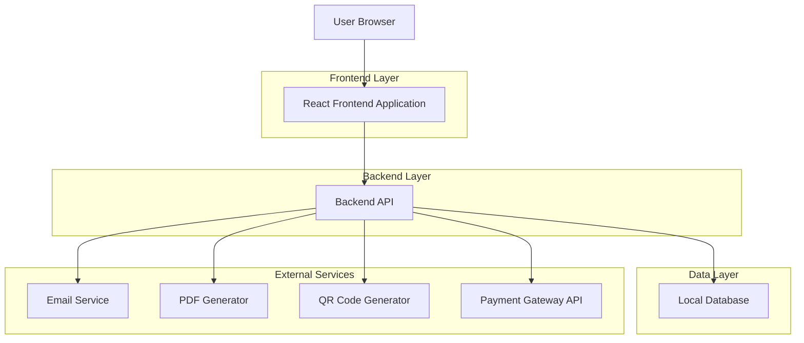
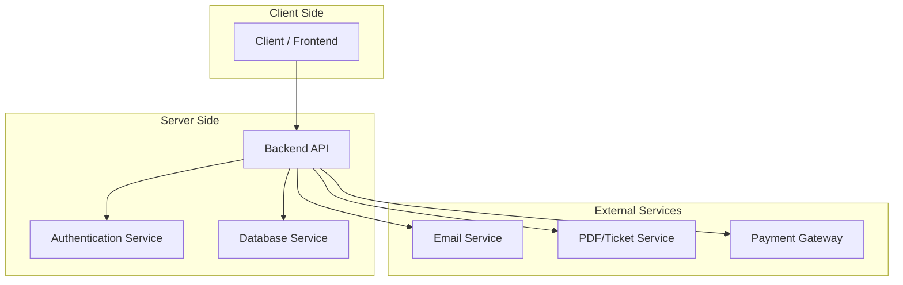
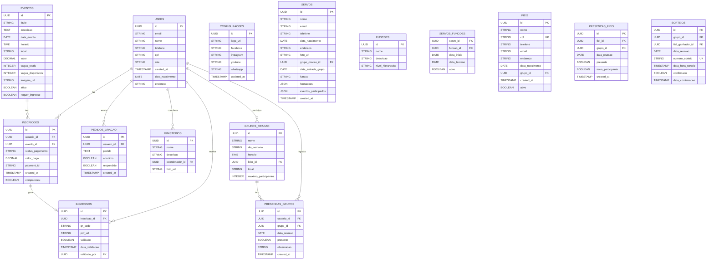

## 1. Architecture design



## 2. Technology Description
- Frontend: React@18 + tailwindcss@3 + vite
- Initialization Tool: vite-init
- Backend: Node.js@18 + Express@4
- Database: PostgreSQL local (já existente)
- Payment Integration: MercadoPago API ou Stripe
- Email Service: Nodemailer ou SendGrid
- PDF Generation: Puppeteer ou PDFKit
- QR Code Generation: qrcode.js
- State Management: React Context + useReducer
- Form Handling: React Hook Form + Yup validation

## 3. Route definitions
| Route | Purpose |
|-------|---------|
| / | Página principal com carrossel, eventos, coordenadores |
| /eventos | Listagem de todos os eventos |
| /eventos/:id | Detalhes do evento e inscrição |
| /login | Página de login único |
| /cadastro | Página de cadastro único |
| /perfil | Perfil do usuário com histórico de inscrições |
| /admin | Dashboard administrativo |
| /admin/eventos | Gestão de eventos |
| /admin/inscricoes | Gestão de inscrições |
| /admin/usuarios | Gestão de usuários |
| /admin/ingressos | Geração e gestão de ingressos |
| /admin/pastoreio | Dashboard de pastoreio e frequência |
| /admin/cadastro-rapido | Cadastro centralizado simplificado |
| /admin/configuracoes | Configurações do site, logo e redes sociais |
| /admin/grupos | Gestão de grupos de oração |
| /admin/servos | Cadastro e gestão de servos |
| /grupos | Listagem pública de grupos de oração |
| /grupos/:id | Detalhes do grupo com GPS |
| /validar-ingresso | Página para validar ingressos com QR code |

## 4. API definitions

### 4.1 Authentication APIs

```
POST /api/auth/login
```
Request:
```json
{
  "email": "usuario@email.com",
  "password": "senha123"
}
```

```
POST /api/auth/register
```
Request:
```json
{
  "email": "usuario@email.com",
  "password": "senha123",
  "nome": "João Silva",
  "telefone": "11999999999",
  "cpf": "123.456.789-09"
}
```

### 4.2 Event Registration APIs

```
POST /api/inscricoes
```
Request:
```json
{
  "evento_id": "uuid-do-evento",
  "usuario_id": "uuid-do-usuario",
  "status_pagamento": "pendente",
  "valor_pago": 50.00
}
```

### 4.3 Ticket Generation APIs

```
POST /api/ingressos/gerar
```
Request:
```json
{
  "inscricao_id": "uuid-da-inscricao"
}
```

```
GET /api/ingressos/validar/{qr_code}
```
Response:
```json
{
  "valido": true,
  "nome_participante": "João Silva",
  "evento": "Encontro de Jovens",
  "data": "2024-01-15"
}
```

### 4.4 Pastoral Management APIs

```
GET /api/pastoreio/frequencia/{grupo_id}
```
Response:
```json
{
  "grupo": "Grupo de Oração - Terça",
  "participantes_ativos": 25,
  "faltantes_ultima_semana": 5,
  "taxa_presenca": "83%"
}
```

```
POST /api/pastoreio/registrar-presenca
```
Request:
```json
{
  "usuario_id": "uuid-do-usuario",
  "grupo_id": "uuid-do-grupo",
  "data_reuniao": "2024-01-15",
  "presente": true
}
```

### 4.5 Pastoral Management APIs - Enhanced

```
POST /api/pastoreio/fieis/cadastro
```
Request:
```json
{
  "nome": "João Silva",
  "cpf": "123.456.789-09",
  "telefone": "11999999999",
  "email": "joao@email.com",
  "endereco": "Rua Exemplo, 123",
  "data_nascimento": "1990-01-15",
  "grupo_id": "uuid-do-grupo"
}
```

```
GET /api/pastoreio/fieis/buscar?query={nome_ou_cpf}
```
Response:
```json
{
  "fieis": [
    {
      "id": "uuid-do-fiel",
      "nome": "João Silva",
      "cpf": "123.456.789-09",
      "telefone": "11999999999",
      "ultima_presenca": "2024-01-10"
    }
  ]
}
```

```
POST /api/pastoreio/presenca/confirmar
```
Request:
```json
{
  "fiel_id": "uuid-do-fiel",
  "data_reuniao": "2024-01-15",
  "grupo_id": "uuid-do-grupo",
  "presente": true
}
```

```
GET /api/pastoreio/presencas/dia/{data}
```
Response:
```json
{
  "data": "2024-01-15",
  "total_presentes": 80,
  "novos_participantes": 5,
  "participantes_antes": 75,
  "permite_sorteio": true
}
```

```
POST /api/pastoreio/sorteio/realizar
```
Request:
```json
{
  "data_reuniao": "2024-01-15",
  "grupo_id": "uuid-do-grupo"
}
```
Response:
```json
{
  "ganhador": {
    "id": "uuid-do-fiel",
    "nome": "João Silva",
    "cpf": "123.456.789-09"
  },
  "numero_sorteio": "00123",
  "data_hora": "2024-01-15T20:30:00Z"
}
```

```
POST /api/pastoreio/sorteio/confirmar
```
Request:
```json
{
  "sorteio_id": "uuid-do-sorteio",
  "fiel_id": "uuid-do-fiel",
  "confirmado": true
}
```

```
GET /api/pastoreio/metricas/frequencia
```
Response:
```json
{
  "total_fieis_cadastrados": 150,
  "fieis_ativos_ultimos_30_dias": 120,
  "fieis_ausentes_30_dias": 30,
  "taxa_presenca_geral": "80%",
  "frequencia_por_grupo": [
    {
      "grupo_id": "uuid-grupo",
      "nome": "Terça Feira",
      "media_presenca": "85%"
    }
  ]
}
```

```
POST /api/pastoreio/comunicacao/ausentes
```
Request:
```json
{
  "dias_ausente": 30,
  "mensagem": " Saudades da sua presença no grupo de oração!",
  "canal": "whatsapp"
}
```

### 4.3 Payment Integration APIs

```
POST /api/create-payment
```
Request:
```json
{
  "inscricao_id": "uuid-da-inscricao",
  "valor": 50.00,
  "descricao": "Inscrição - Encontro de Jovens"
}
```

### 4.4 Site Configuration APIs

```
POST /api/configuracoes/logo
```
Request:
```json
{
  "logo_url": "url-da-logo-uploaded"
}
```

```
POST /api/configuracoes/redes-sociais
```
Request:
```json
{
  "facebook": "https://facebook.com/igreja",
  "instagram": "https://instagram.com/igreja",
  "youtube": "https://youtube.com/igreja",
  "whatsapp": "5511999999999"
}
```

### 4.5 Prayer Groups APIs

```
GET /api/grupos-oracao
```
Response:
```json
{
  "grupos": [
    {
      "id": "uuid-grupo",
      "nome": "Grupo Terça Feira",
      "dia_semana": "Terça",
      "horario": "19:30",
      "local": "Rua Exemplo, 123",
      "coordenadas": "-23.5505,-46.6333",
      "foto_url": "url-da-foto"
    }
  ]
}
```

```
GET /api/grupos-oracao/:id
```

### 4.6 Servant Registration APIs

```
POST /api/servos
```
Request:
```json
{
  "nome": "João Silva",
  "email": "joao@email.com",
  "telefone": "11999999999",
  "data_nascimento": "1990-01-15",
  "endereco": "Rua Exemplo, 123",
  "foto_url": "url-da-foto",
  "ministerios": ["musica", "intercessao"],
  "funcao": "coordenador",
  "data_entrada_grupo": "2020-01-01",
  "formacoes": ["Escola Bíblica 2021", "Conferência de Líderes 2022"],
  "eventos_participados": ["Acampamento 2021", "Conferência 2022"]
}
```

```
GET /api/servos/:id/pdf
```
Response: PDF file stream

## 5. Server architecture diagram



## 6. Data model

### 6.1 Data model definition



### 6.2 Data Definition Language

Users Table (users)
```sql
-- create table
CREATE TABLE users (
  id UUID PRIMARY KEY DEFAULT gen_random_uuid(),
  email VARCHAR(255) UNIQUE NOT NULL,
  nome VARCHAR(100) NOT NULL,
  telefone VARCHAR(20),
  role VARCHAR(20) DEFAULT 'member' CHECK (role IN ('member', 'admin')),
  created_at TIMESTAMP WITH TIME ZONE DEFAULT NOW()
);

-- create policies
ALTER TABLE users ENABLE ROW LEVEL SECURITY;

-- allow users to read their own data
CREATE POLICY "Users can view own profile" 
  ON users FOR SELECT 
  USING (auth.uid() = id);

-- allow admin to read all users
CREATE POLICY "Admin can view all users" 
  ON users FOR SELECT 
  USING (EXISTS (
    SELECT 1 FROM users 
    WHERE id = auth.uid() AND role = 'admin'
  ));
```

Tickets Table (ingressos)
```sql
-- create table
CREATE TABLE ingressos (
  id UUID PRIMARY KEY DEFAULT gen_random_uuid(),
  inscricao_id UUID REFERENCES inscricoes(id) ON DELETE CASCADE,
  qr_code VARCHAR(100) UNIQUE NOT NULL,
  pdf_url VARCHAR(500),
  validado BOOLEAN DEFAULT false,
  data_validacao TIMESTAMP,
  validado_por UUID REFERENCES users(id),
  created_at TIMESTAMP WITH TIME ZONE DEFAULT NOW()
);

-- create index for QR code validation
CREATE INDEX idx_ingressos_qr_code ON ingressos(qr_code);
CREATE INDEX idx_ingressos_inscricao ON ingressos(inscricao_id);
```

Prayer Groups Table (grupos_oracao)
```sql
-- create table
CREATE TABLE grupos_oracao (
  id UUID PRIMARY KEY DEFAULT gen_random_uuid(),
  nome VARCHAR(100) NOT NULL,
  dia_semana VARCHAR(20) NOT NULL,
  horario TIME NOT NULL,
  lider_id UUID REFERENCES users(id),
  local VARCHAR(200),
  maximo_participantes INTEGER DEFAULT 50,
  ativo BOOLEAN DEFAULT true,
  created_at TIMESTAMP WITH TIME ZONE DEFAULT NOW()
);
```

Group Attendance Table (presencas_grupos)
```sql
-- create table
CREATE TABLE presencas_grupos (
  id UUID PRIMARY KEY DEFAULT gen_random_uuid(),
  usuario_id UUID REFERENCES users(id) ON DELETE CASCADE,
  grupo_id UUID REFERENCES grupos_oracao(id) ON DELETE CASCADE,
  data_reuniao DATE NOT NULL,
  presente BOOLEAN DEFAULT true,
  observacao TEXT,
  created_at TIMESTAMP WITH TIME ZONE DEFAULT NOW(),
  UNIQUE(usuario_id, grupo_id, data_reuniao)
);

-- create indexes for attendance queries
CREATE INDEX idx_presencas_usuario ON presencas_grupos(usuario_id);
CREATE INDEX idx_presencas_grupo ON presencas_grupos(grupo_id);
CREATE INDEX idx_presencas_data ON presencas_grupos(data_reuniao);
```

Events Table (eventos)
```sql
-- create table
CREATE TABLE eventos (
  id UUID PRIMARY KEY DEFAULT gen_random_uuid(),
  titulo VARCHAR(200) NOT NULL,
  descricao TEXT,
  data_evento DATE NOT NULL,
  horario TIME,
  local VARCHAR(200),
  valor DECIMAL(10,2) DEFAULT 0,
  vagas_totais INTEGER DEFAULT 0,
  vagas_disponiveis INTEGER DEFAULT 0,
  imagem_url VARCHAR(500),
  ativo BOOLEAN DEFAULT true,
  created_at TIMESTAMP WITH TIME ZONE DEFAULT NOW()
);

-- create policies
ALTER TABLE eventos ENABLE ROW LEVEL SECURITY;

-- allow public to view active events
CREATE POLICY "Public can view active events" 
  ON eventos FOR SELECT 
  USING (ativo = true);

-- allow admin full access
CREATE POLICY "Admin can manage events" 
  ON eventos FOR ALL 
  USING (EXISTS (
    SELECT 1 FROM users 
    WHERE id = auth.uid() AND role = 'admin'
  ));
```

Registrations Table (inscricoes)
```sql
-- create table
CREATE TABLE inscricoes (
  id UUID PRIMARY KEY DEFAULT gen_random_uuid(),
  usuario_id UUID REFERENCES users(id),
  evento_id UUID REFERENCES eventos(id),
  status_pagamento VARCHAR(50) DEFAULT 'pendente',
  valor_pago DECIMAL(10,2) DEFAULT 0,
  payment_id VARCHAR(100),
  created_at TIMESTAMP WITH TIME ZONE DEFAULT NOW(),
  UNIQUE(usuario_id, evento_id)
);

-- create policies
ALTER TABLE inscricoes ENABLE ROW LEVEL SECURITY;

-- users can view own registrations
CREATE POLICY "Users can view own registrations" 
  ON inscricoes FOR SELECT 
  USING (auth.uid() = usuario_id);

-- users can create own registrations
CREATE POLICY "Users can create registrations" 
  ON inscricoes FOR INSERT 
  WITH CHECK (auth.uid() = usuario_id);

-- admin can view all registrations
CREATE POLICY "Admin can view all registrations" 
  ON inscricoes FOR SELECT 
  USING (EXISTS (
    SELECT 1 FROM users 
    WHERE id = auth.uid() AND role = 'admin'
  ));
```

Prayer Requests Table (pedidos_oracao)
```sql
-- create table
CREATE TABLE pedidos_oracao (
  id UUID PRIMARY KEY DEFAULT gen_random_uuid(),
  usuario_id UUID REFERENCES users(id),
  pedido TEXT NOT NULL,
  anonimo BOOLEAN DEFAULT false,
  respondido BOOLEAN DEFAULT false,
  created_at TIMESTAMP WITH TIME ZONE DEFAULT NOW()
);

-- create policies
ALTER TABLE pedidos_oracao ENABLE ROW LEVEL SECURITY;

-- public can create prayer requests
CREATE POLICY "Public can create prayer requests" 
  ON pedidos_oracao FOR INSERT 
  WITH CHECK (true);

-- admin can view all prayer requests
CREATE POLICY "Admin can view prayer requests" 
  ON pedidos_oracao FOR SELECT 
  USING (EXISTS (
    SELECT 1 FROM users 
    WHERE id = auth.uid() AND role = 'admin'
  ));
```

Ministries Table (ministerios)
```sql
-- create table
CREATE TABLE ministerios (
  id UUID PRIMARY KEY DEFAULT gen_random_uuid(),
  nome VARCHAR(100) NOT NULL,
  descricao TEXT,
  coordenador_id UUID REFERENCES users(id),
  foto_url VARCHAR(500),
  ordem_exibicao INTEGER DEFAULT 0
);

-- create policies
ALTER TABLE ministerios ENABLE ROW LEVEL SECURITY;

-- public can view ministries
CREATE POLICY "Public can view ministries" 
  ON ministerios FOR SELECT 
  USING (true);

-- allow admin to manage ministries
CREATE POLICY "Admin can manage ministries" 
  ON ministerios FOR ALL 
  USING (EXISTS (
    SELECT 1 FROM users 
    WHERE id = auth.uid() AND role = 'admin'
  ));
```

Site Configuration Table (configuracoes)
```sql
-- create table
CREATE TABLE configuracoes (
  id UUID PRIMARY KEY DEFAULT gen_random_uuid(),
  logo_url VARCHAR(500),
  facebook VARCHAR(200),
  instagram VARCHAR(200),
  youtube VARCHAR(200),
  whatsapp VARCHAR(20),
  updated_at TIMESTAMP WITH TIME ZONE DEFAULT NOW()
);

-- insert default configuration
INSERT INTO configuracoes (logo_url, facebook, instagram, youtube, whatsapp) 
VALUES (NULL, NULL, NULL, NULL, NULL);
```

Fiéis Table (fieis)
```sql
-- create table
CREATE TABLE fieis (
  id UUID PRIMARY KEY DEFAULT gen_random_uuid(),
  nome VARCHAR(100) NOT NULL,
  cpf VARCHAR(14) UNIQUE NOT NULL,
  telefone VARCHAR(20),
  email VARCHAR(255),
  endereco VARCHAR(300),
  data_nascimento DATE,
  grupo_id UUID REFERENCES grupos_oracao(id),
  ativo BOOLEAN DEFAULT true,
  created_at TIMESTAMP WITH TIME ZONE DEFAULT NOW(),
  updated_at TIMESTAMP WITH TIME ZONE DEFAULT NOW()
);

-- create indexes
CREATE INDEX idx_fieis_cpf ON fieis(cpf);
CREATE INDEX idx_fieis_nome ON fieis(nome);
CREATE INDEX idx_fieis_grupo ON fieis(grupo_id);
CREATE INDEX idx_fieis_ativo ON fieis(ativo);

-- create policies
ALTER TABLE fieis ENABLE ROW LEVEL SECURITY;

-- allow admin to manage fieis
CREATE POLICY "Admin can manage fieis" 
  ON fieis FOR ALL 
  USING (EXISTS (
    SELECT 1 FROM users 
    WHERE id = auth.uid() AND role = 'admin'
  ));
```

Presenças Fiéis Table (presencas_fieis)
```sql
-- create table
CREATE TABLE presencas_fieis (
  id UUID PRIMARY KEY DEFAULT gen_random_uuid(),
  fiel_id UUID REFERENCES fieis(id) ON DELETE CASCADE,
  grupo_id UUID REFERENCES grupos_oracao(id) ON DELETE CASCADE,
  data_reuniao DATE NOT NULL,
  presente BOOLEAN DEFAULT true,
  novo_participante BOOLEAN DEFAULT false,
  created_at TIMESTAMP WITH TIME ZONE DEFAULT NOW(),
  UNIQUE(fiel_id, grupo_id, data_reuniao)
);

-- create indexes
CREATE INDEX idx_presencas_fieis_fiel ON presencas_fieis(fiel_id);
CREATE INDEX idx_presencas_fieis_grupo ON presencas_fieis(grupo_id);
CREATE INDEX idx_presencas_fieis_data ON presencas_fieis(data_reuniao);
CREATE INDEX idx_presencas_fieis_presente ON presencas_fieis(presente);

-- create policies
ALTER TABLE presencas_fieis ENABLE ROW LEVEL SECURITY;

-- allow admin to manage presencas
CREATE POLICY "Admin can manage presencas" 
  ON presencas_fieis FOR ALL 
  USING (EXISTS (
    SELECT 1 FROM users 
    WHERE id = auth.uid() AND role = 'admin'
  ));
```

Sorteios Table (sorteios)
```sql
-- create table
CREATE TABLE sorteios (
  id UUID PRIMARY KEY DEFAULT gen_random_uuid(),
  grupo_id UUID REFERENCES grupos_oracao(id) ON DELETE CASCADE,
  fiel_ganhador_id UUID REFERENCES fieis(id) ON DELETE CASCADE,
  data_reuniao DATE NOT NULL,
  numero_sorteio VARCHAR(10) UNIQUE NOT NULL,
  data_hora_sorteio TIMESTAMP WITH TIME ZONE DEFAULT NOW(),
  confirmado BOOLEAN DEFAULT false,
  data_confirmacao TIMESTAMP,
  created_at TIMESTAMP WITH TIME ZONE DEFAULT NOW()
);

-- create indexes
CREATE INDEX idx_sorteios_grupo ON sorteios(grupo_id);
CREATE INDEX idx_sorteios_fiel ON sorteios(fiel_ganhador_id);
CREATE INDEX idx_sorteios_data ON sorteios(data_reuniao);
CREATE INDEX idx_sorteios_numero ON sorteios(numero_sorteio);

-- create policies
ALTER TABLE sorteios ENABLE ROW LEVEL SECURITY;

-- allow admin to manage sorteios
CREATE POLICY "Admin can manage sorteios" 
  ON sorteios FOR ALL 
  USING (EXISTS (
    SELECT 1 FROM users 
    WHERE id = auth.uid() AND role = 'admin'
  ));
```

Servants Table (servos)
```sql
-- create table
CREATE TABLE servos (
  id UUID PRIMARY KEY DEFAULT gen_random_uuid(),
  nome VARCHAR(100) NOT NULL,
  email VARCHAR(255) UNIQUE NOT NULL,
  telefone VARCHAR(20),
  data_nascimento DATE,
  endereco VARCHAR(300),
  foto_url VARCHAR(500),
  grupo_oracao_id UUID REFERENCES grupos_oracao(id),
  data_entrada_grupo DATE,
  funcao VARCHAR(100),
  formacoes JSON DEFAULT '[]',
  eventos_participados JSON DEFAULT '[]',
  created_at TIMESTAMP WITH TIME ZONE DEFAULT NOW(),
  updated_at TIMESTAMP WITH TIME ZONE DEFAULT NOW()
);

-- create policies
ALTER TABLE servos ENABLE ROW LEVEL SECURITY;

-- allow admin full access
CREATE POLICY "Admin can manage servants" 
  ON servos FOR ALL 
  USING (EXISTS (
    SELECT 1 FROM users 
    WHERE id = auth.uid() AND role = 'admin'
  ));
```

Roles Table (funcoes)
```sql
-- create table
CREATE TABLE funcoes (
  id UUID PRIMARY KEY DEFAULT gen_random_uuid(),
  nome VARCHAR(100) NOT NULL,
  descricao TEXT,
  nivel_hierarquico VARCHAR(50) DEFAULT 'membro',
  created_at TIMESTAMP WITH TIME ZONE DEFAULT NOW()
);

-- insert default roles
INSERT INTO funcoes (nome, descricao, nivel_hierarquico) VALUES
('Coordenador', 'Responsável por coordenar um ministério', 'lider'),
('Vice-Coordenador', 'Auxilia o coordenador', 'sub-lider'),
('Servo', 'Membro ativo do ministério', 'membro'),
('Intercessor', 'Responsável pela intercessão', 'membro'),
('Músico', 'Participa do ministério de música', 'membro'),
('Recepcionista', 'Recebe visitantes', 'membro'),
('Professor EBD', 'Professor da Escola Bíblica Dominical', 'servo');
```

Servant Roles Table (servos_funcoes)
```sql
-- create table
CREATE TABLE servos_funcoes (
  id UUID PRIMARY KEY DEFAULT gen_random_uuid(),
  servo_id UUID REFERENCES servos(id) ON DELETE CASCADE,
  funcao_id UUID REFERENCES funcoes(id) ON DELETE CASCADE,
  data_inicio DATE NOT NULL,
  data_termino DATE,
  ativo BOOLEAN DEFAULT true,
  created_at TIMESTAMP WITH TIME ZONE DEFAULT NOW(),
  UNIQUE(servo_id, funcao_id, data_inicio)
);

-- create indexes
CREATE INDEX idx_servos_funcoes_servos ON servos_funcoes(servo_id);
CREATE INDEX idx_servos_funcoes_funcao ON servos_funcoes(funcao_id);
CREATE INDEX idx_servos_funcoes_ativo ON servos_funcoes(ativo);
```