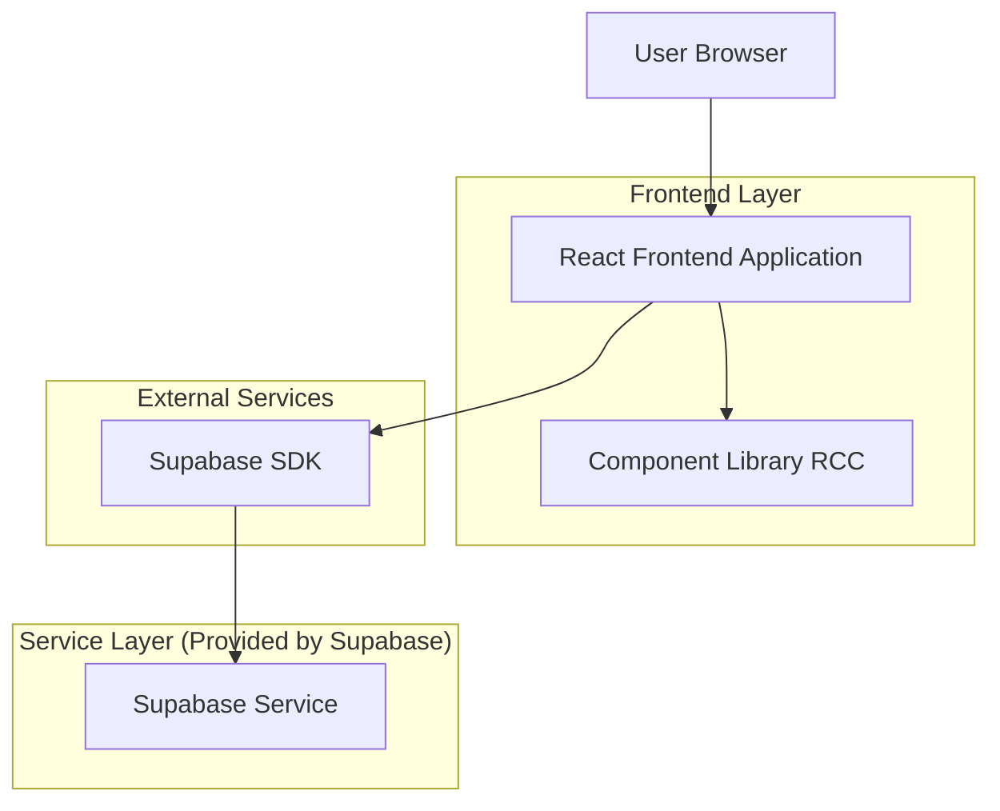
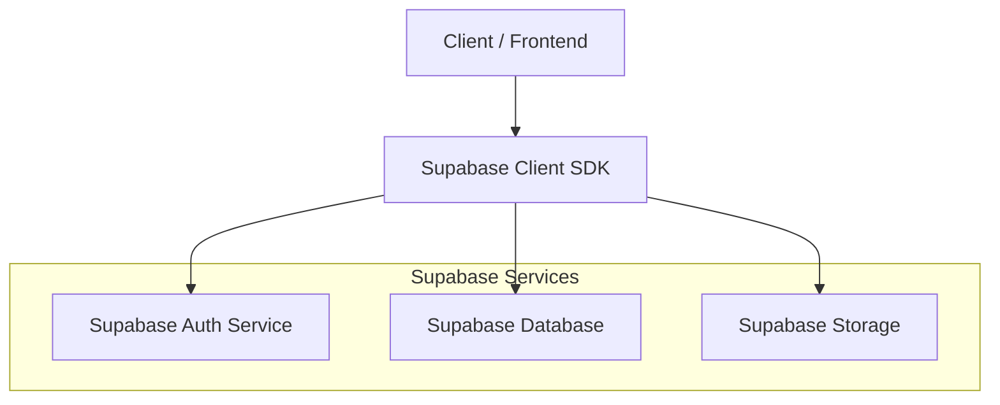
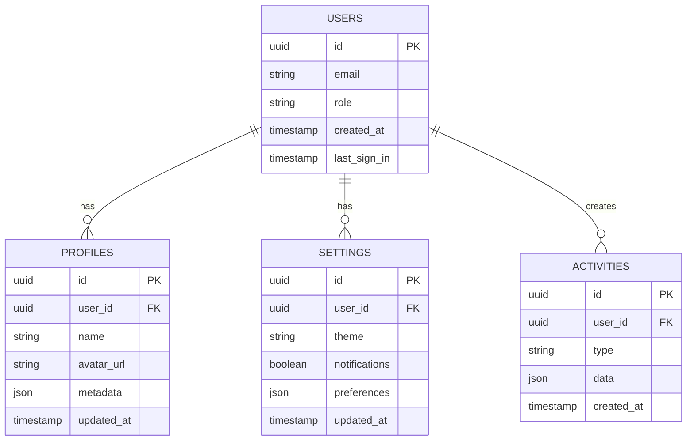

## 1. Architecture design



## 2. Technology Description

* Frontend: React\@18 + tailwindcss\@3 + vite

* Initialization Tool: vite-init

* Backend: Supabase (BaaS)

* UI Components: Headless UI + Radix UI

* State Management: React Context + useReducer

* Styling: Tailwind CSS com configuração customizada para paleta RCC

## 3. Route definitions

| Route      | Purpose                                        |
| ---------- | ---------------------------------------------- |
| /          | Página inicial com hero section e navegação    |
| /login     | Página de autenticação do usuário              |
| /dashboard | Dashboard principal com widgets e estatísticas |
| /profile   | Página de perfil do usuário                    |
| /settings  | Configurações e preferências do usuário        |
| /admin     | Painel administrativo (apenas para admins)     |

## 4. API definitions

### 4.1 Core API

**Autenticação via Supabase**

```javascript
// Login com email/senha
const { data, error } = await supabase.auth.signInWithPassword({
  email: 'user@example.com',
  password: 'password123'
})

// Registro de novo usuário
const { data, error } = await supabase.auth.signUp({
  email: 'newuser@example.com',
  password: 'password123',
  options: {
    data: {
      name: 'Nome do Usuário',
      role: 'user'
    }
  }
})
```

**CRUD Operations**

```javascript
// Listar dados com filtros
const { data, error } = await supabase
  .from('table_name')
  .select('*')
  .eq('user_id', user.id)
  .order('created_at', { ascending: false })

// Inserir novo registro
const { data, error } = await supabase
  .from('table_name')
  .insert([{ field: 'value', user_id: user.id }])

// Atualizar registro
const { data, error } = await supabase
  .from('table_name')
  .update({ field: 'new_value' })
  .eq('id', recordId)
```

## 5. Server architecture diagram



## 6. Data model

### 6.1 Data model definition



### 6.2 Data Definition Language

**Tabela de Usuários (users)**

```sql
-- Tabela de autenticação gerenciada pelo Supabase Auth
-- Configurações de segurança:
GRANT SELECT ON auth.users TO anon;
GRANT ALL ON auth.users TO authenticated;
```

**Tabela de Perfis (profiles)**

```sql
-- create table
CREATE TABLE profiles (
    id UUID PRIMARY KEY DEFAULT gen_random_uuid(),
    user_id UUID REFERENCES auth.users(id) ON DELETE CASCADE UNIQUE,
    name VARCHAR(100) NOT NULL,
    avatar_url TEXT,
    metadata JSONB DEFAULT '{}',
    created_at TIMESTAMP WITH TIME ZONE DEFAULT NOW(),
    updated_at TIMESTAMP WITH TIME ZONE DEFAULT NOW()
);

-- create index
CREATE INDEX idx_profiles_user_id ON profiles(user_id);

-- grant permissions
GRANT SELECT ON profiles TO anon;
GRANT ALL ON profiles TO authenticated;

-- RLS policies
ALTER TABLE profiles ENABLE ROW LEVEL SECURITY;

CREATE POLICY "Usuários podem ver todos os perfis" ON profiles
    FOR SELECT USING (true);

CREATE POLICY "Usuários podem editar seu próprio perfil" ON profiles
    FOR ALL USING (auth.uid() = user_id)
    WITH CHECK (auth.uid() = user_id);
```

**Tabela de Configurações (settings)**

```sql
-- create table
CREATE TABLE settings (
    id UUID PRIMARY KEY DEFAULT gen_random_uuid(),
    user_id UUID REFERENCES auth.users(id) ON DELETE CASCADE UNIQUE,
    theme VARCHAR(20) DEFAULT 'light' CHECK (theme IN ('light', 'dark', 'system')),
    notifications BOOLEAN DEFAULT true,
    preferences JSONB DEFAULT '{}',
    created_at TIMESTAMP WITH TIME ZONE DEFAULT NOW(),
    updated_at TIMESTAMP WITH TIME ZONE DEFAULT NOW()
);

-- create index
CREATE INDEX idx_settings_user_id ON settings(user_id);

-- grant permissions
GRANT SELECT ON settings TO anon;
GRANT ALL ON settings TO authenticated;

-- RLS policies
ALTER TABLE settings ENABLE ROW LEVEL SECURITY;

CREATE POLICY "Usuários podem ver configurações próprias" ON settings
    FOR SELECT USING (auth.uid() = user_id);

CREATE POLICY "Usuários podem editar próprias configurações" ON settings
    FOR ALL USING (auth.uid() = user_id)
    WITH CHECK (auth.uid() = user_id);
```

**Tabela de Atividades (activities)**

```sql
-- create table
CREATE TABLE activities (
    id UUID PRIMARY KEY DEFAULT gen_random_uuid(),
    user_id UUID REFERENCES auth.users(id) ON DELETE CASCADE,
    type VARCHAR(50) NOT NULL,
    data JSONB DEFAULT '{}',
    created_at TIMESTAMP WITH TIME ZONE DEFAULT NOW()
);

-- create index
CREATE INDEX idx_activities_user_id ON activities(user_id);
CREATE INDEX idx_activities_created_at ON activities(created_at DESC);

-- grant permissions
GRANT SELECT ON activities TO anon;
GRANT ALL ON activities TO authenticated;

-- RLS policies
ALTER TABLE activities ENABLE ROW LEVEL SECURITY;

CREATE POLICY "Usuários podem ver próprias atividades" ON activities
    FOR SELECT USING (auth.uid() = user_id);

CREATE POLICY "Usuários podem criar atividades próprias" ON activities
    FOR INSERT WITH CHECK (auth.uid() = user_id);
```

