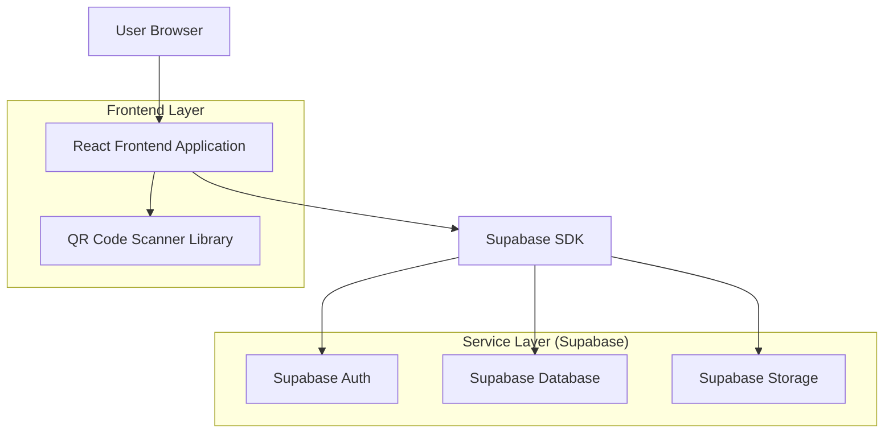
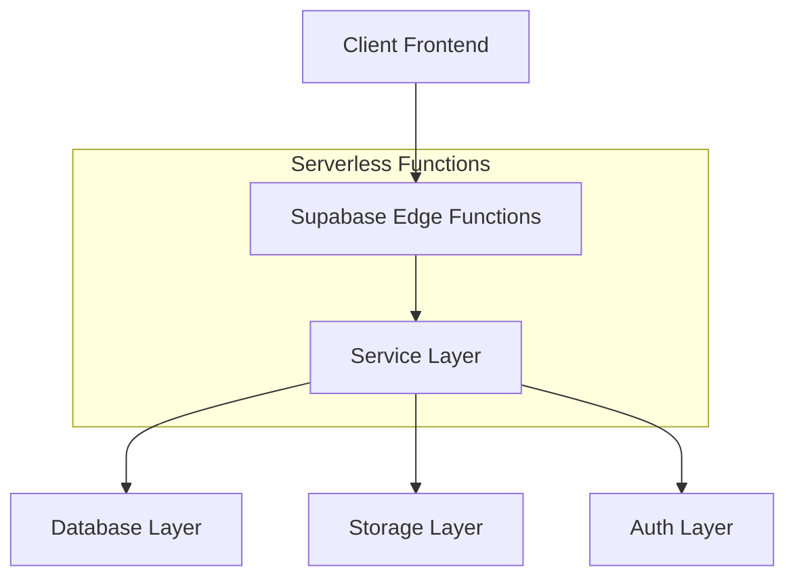
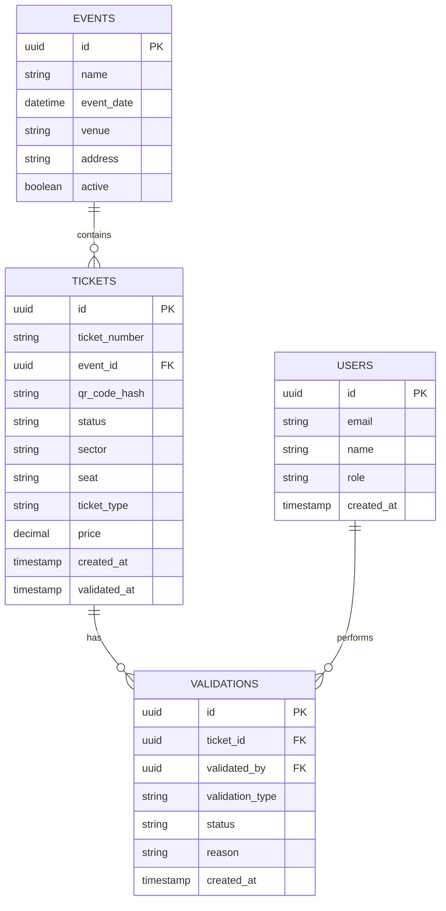

# Arquitetura Técnica - Modernização do Ticket Scanner

## 1. Arquitetura do Sistema



## 2. Stack Tecnológica

- **Frontend**: React@18 + TypeScript + Vite
- **Estilização**: TailwindCSS@3 + HeadlessUI
- **Bibliotecas UI**: Lucide React (ícones), React QR Code Scanner
- **Backend**: Supabase (BaaS)
- **Autenticação**: Supabase Auth
- **Banco de Dados**: PostgreSQL (via Supabase)
- **Armazenamento**: Supabase Storage para imagens
- **Ferramenta de Inicialização**: vite-init

## 3. Definições de Rotas

| Rota | Propósito |
|------|-----------|
| /admin/ticket-scanner | Página principal do scanner de ingressos |
| /admin/ticket-viewer/:ticketId | Visualização detalhada do ingresso escaneado |
| /admin/history | Histórico de ingressos validados |
| /admin/login | Login do administrador |

## 4. Definições de API

### 4.1 API de Validação de Ingresso

```
POST /api/tickets/validate
```

Request:
| Parâmetro | Tipo | Obrigatório | Descrição |
|-----------|------|-------------|-----------|
| ticketId | string | true | ID único do ingresso |
| validationCode | string | true | Código de validação do QR |
| scannerId | string | true | ID do scanner/admin |

Response:
| Parâmetro | Tipo | Descrição |
|-----------|------|-------------|
| valid | boolean | Status de validade do ingresso |
| ticketData | object | Dados completos do ingresso |
| message | string | Mensagem de status |

### 4.2 API de Atualização de Status

```
PUT /api/tickets/:ticketId/status
```

Request:
| Parâmetro | Tipo | Obrigatório | Descrição |
|-----------|------|-------------|-----------|
| status | string | true | Novo status (validado/invalidado) |
| reason | string | false | Motivo da invalidação |

## 5. Arquitetura do Servidor



## 6. Modelo de Dados

### 6.1 Diagrama ER



### 6.2 Definições DDL

**Tabela de Ingressos (tickets)**
```sql
-- Criar tabela
CREATE TABLE tickets (
    id UUID PRIMARY KEY DEFAULT gen_random_uuid(),
    ticket_number VARCHAR(50) UNIQUE NOT NULL,
    event_id UUID REFERENCES events(id),
    qr_code_hash VARCHAR(255) NOT NULL,
    status VARCHAR(20) DEFAULT 'valid' CHECK (status IN ('valid', 'validated', 'invalid')),
    sector VARCHAR(100),
    seat VARCHAR(50),
    ticket_type VARCHAR(50),
    price DECIMAL(10,2),
    buyer_name VARCHAR(255),
    buyer_email VARCHAR(255),
    buyer_cpf VARCHAR(14),
    created_at TIMESTAMP WITH TIME ZONE DEFAULT NOW(),
    validated_at TIMESTAMP WITH TIME ZONE
);

-- Índices
CREATE INDEX idx_tickets_ticket_number ON tickets(ticket_number);
CREATE INDEX idx_tickets_qr_hash ON tickets(qr_code_hash);
CREATE INDEX idx_tickets_status ON tickets(status);
CREATE INDEX idx_tickets_event_id ON tickets(event_id);

-- Permissões Supabase
GRANT SELECT ON tickets TO anon;
GRANT ALL PRIVILEGES ON tickets TO authenticated;
```

**Tabela de Validações (validations)**
```sql
-- Criar tabela
CREATE TABLE validations (
    id UUID PRIMARY KEY DEFAULT gen_random_uuid(),
    ticket_id UUID REFERENCES tickets(id),
    validated_by UUID REFERENCES auth.users(id),
    validation_type VARCHAR(20) DEFAULT 'qr_code',
    status VARCHAR(20) NOT NULL,
    reason TEXT,
    created_at TIMESTAMP WITH TIME ZONE DEFAULT NOW()
);

-- Índices
CREATE INDEX idx_validations_ticket_id ON validations(ticket_id);
CREATE INDEX idx_validations_validated_by ON validations(validated_by);
CREATE INDEX idx_validations_created_at ON validations(created_at DESC);

-- Permissões Supabase
GRANT SELECT ON validations TO anon;
GRANT ALL PRIVILEGES ON validations TO authenticated;
```

**Tabela de Eventos (events)**
```sql
-- Criar tabela
CREATE TABLE events (
    id UUID PRIMARY KEY DEFAULT gen_random_uuid(),
    name VARCHAR(255) NOT NULL,
    event_date TIMESTAMP WITH TIME ZONE NOT NULL,
    venue VARCHAR(255),
    address TEXT,
    description TEXT,
    active BOOLEAN DEFAULT true,
    created_at TIMESTAMP WITH TIME ZONE DEFAULT NOW()
);

-- Índices
CREATE INDEX idx_events_active ON events(active);
CREATE INDEX idx_events_date ON events(event_date);

-- Permissões Supabase
GRANT SELECT ON events TO anon;
GRANT ALL PRIVILEGES ON events TO authenticated;
```

## 7. Componentes React Principais

### 7.1 Estrutura de Componentes

```
src/
├── components/
│   ├── scanner/
│   │   ├── QRScanner.tsx
│   │   ├── ScannerControls.tsx
│   │   └── ValidationIndicator.tsx
│   ├── ticket/
│   │   ├── TicketDisplay.tsx
│   │   ├── TicketActions.tsx
│   │   └── TicketInfo.tsx
│   └── ui/
│       ├── Card.tsx
│       ├── Button.tsx
│       └── LoadingSpinner.tsx
├── hooks/
│   ├── useQRScanner.ts
│   ├── useTicketValidation.ts
│   └── useCamera.ts
└── utils/
    ├── qrCodeParser.ts
    └── ticketFormatter.ts
```

### 7.2 Estado Global (Context API)

```typescript
interface TicketContextType {
  currentTicket: Ticket | null;
  isScanning: boolean;
  validationHistory: Validation[];
  scanTicket: (qrData: string) => Promise<void>;
  validateTicket: (ticketId: string, status: string) => Promise<void>;
}
```

## 8. Segurança e Performance

### 8.1 Segurança
- Validação de QR code com hash único
- Rate limiting nas requisições
- Sanitização de dados de entrada
- HTTPS obrigatório para câmera

### 8.2 Performance
- Lazy loading dos componentes
- Cache de validações recentes
- Otimização de imagens
- Debounce no scanner de QR