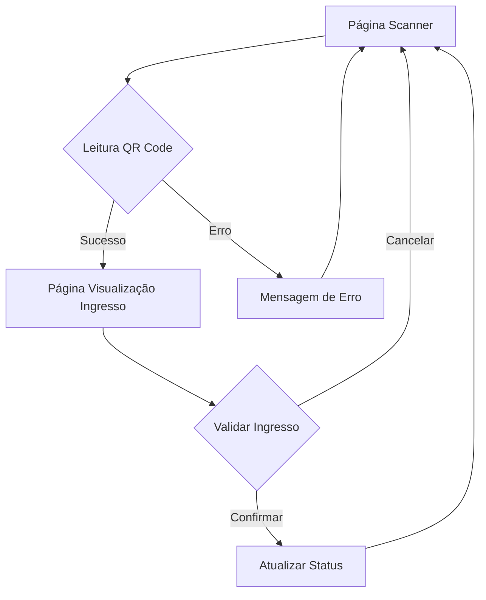

# Modernização do Ticket Scanner - Documentação de Produto

## 1. Visão Geral do Produto

O ticket scanner é uma ferramenta de validação de ingressos que permite leitura de QR codes e visualização organizada das informações do ingresso. A modernização visa criar uma interface moderna, responsiva e intuitiva para melhorar a experiência do usuário tanto em dispositivos móveis quanto desktop.

**Problema a resolver:** Interface atual precisa de refinamento visual e melhor adaptação para diferentes tamanhos de tela.
**Público-alvo:** Administradores e equipe de controle de acesso de eventos.
**Valor:** Agilidade no processo de validação de ingressos com interface profissional e moderna.

## 2. Funcionalidades Principais

### 2.1 Páginas e Módulos

O sistema consiste nas seguintes páginas principais:

1. **Página de Scanner**: Interface de leitura de QR code com câmera/Upload
2. **Página de Visualização de Ingresso**: Exibição detalhada e organizada dos dados do ingresso
3. **Página de Histórico**: Registro de ingressos validados (opcional)

### 2.2 Detalhamento de Funcionalidades

| Página | Módulo | Descrição da Funcionalidade |
|--------|---------|---------------------------|
| Scanner | Área de Leitura | Ativar câmera do dispositivo para leitura em tempo real |
| Scanner | Upload de Imagem | Permitir upload de imagem com QR code para leitura offline |
| Scanner | Indicador Visual | Mostrar status da leitura (escaneando, sucesso, erro) |
| Scanner | Botões de Ação | Controles para alternar câmera, flash, e reescanear |
| Visualização Ingresso | Cabeçalho | Exibir nome do evento e status de validação |
| Visualização Ingresso | Dados do Ingresso | Mostrar número do ingresso, tipo, setor, assento |
| Visualização Ingresso | Dados do Comprador | Exibir nome, email, CPF do titular |
| Visualização Ingresso | Informações do Evento | Data, horário, local do evento |
| Visualização Ingresso | Ações | Botões para validar, invalidar ou voltar ao scanner |

## 3. Fluxo de Navegação

## 4. Design de Interface

### 4.1 Estilo Visual

**Cores Principais:**
- Primária: `#2563eb` (Azul moderno)
- Secundária: `#10b981` (Verde sucesso)
- Erro: `#ef4444` (Vermelho alerta)
- Fundo: `#ffffff` e `#f8fafc` (Cinza claro)

**Elementos de Design:**
- Botões arredondados com sombra suave
- Tipografia moderna (Inter ou Roboto)
- Cards com bordas arredondadas e sombras
- Ícones minimalistas do Lucide React

### 4.2 Layout por Página

| Página | Módulo | Elementos de UI |
|--------|---------|----------------|
| Scanner | Área de Leitura | Container de vídeo fullscreen com overlay de guias de alinhamento, indicador de foco animado |
| Scanner | Controles | Botões flutuantes para flash, switch câmera, com ícones intuitivos |
| Visualização | Layout Geral | Card centralizado com máximo de 600px, header com gradiente, seções bem espaçadas |
| Visualização | Informações | Grid responsivo 2 colunas (desktop) / 1 coluna (mobile), labels em negrito, dados em texto normal |

### 4.3 Responsividade

- **Desktop-first** com breakpoints em 768px e 1024px
- Layout adaptativo: sidebar colapsável em tablets
- Touch-optimized: botões mínimos 44px, espaçamento generoso
- Fontes escaláveis: 16px base, 14px mobile

### 4.4 Animações e Transições

- Fade-in suave na transição entre páginas (300ms)
- Pulse animation no indicador de escaneamento
- Slide-up card na visualização do ingresso
- Hover effects nos botões de ação

## 5. Requisitos Técnicos

### 5.1 Performance
- Carregamento inicial < 3 segundos
- Leitura de QR code < 1 segundo
- Transições de página < 500ms

### 5.2 Compatibilidade
- Navegadores modernos (Chrome 80+, Firefox 75+, Safari 13+)
- Câmera funcionando em HTTPS
- Funcional offline com service worker

### 5.3 Acessibilidade
- Suporte a leitores de tela
- Navegação por teclado
- Contraste mínimo WCAG 4.5:1
- Textos alternativos em imagens